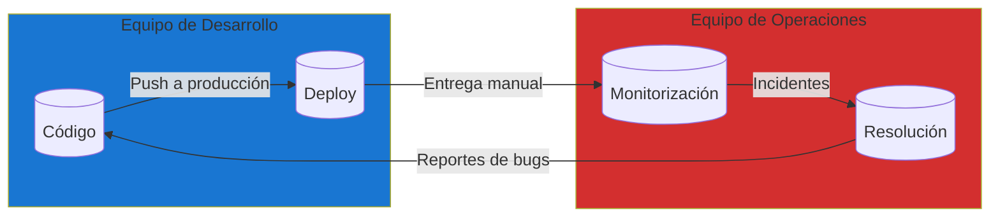
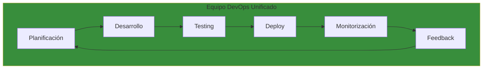
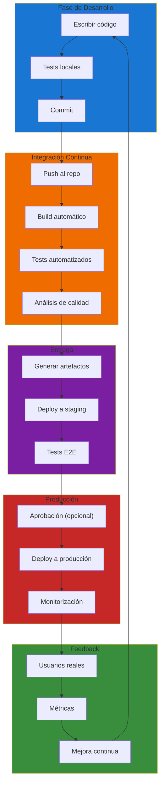
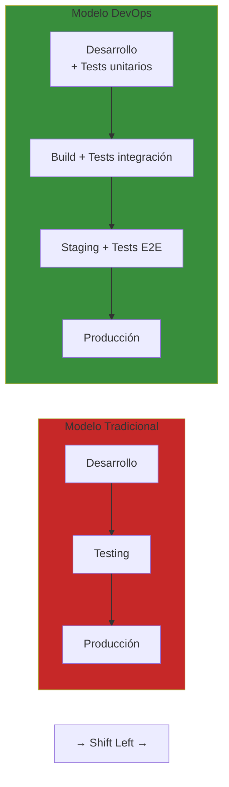
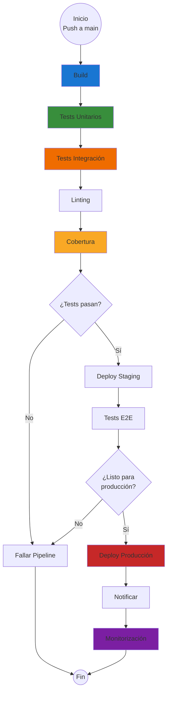
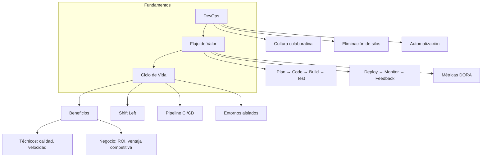

- [1. Fundamentos: DevOps y el Ciclo de Vida](#1-fundamentos-devops-y-el-ciclo-de-vida)
  - [1.1. ¿Qué es DevOps? Más allá de una herramienta, una cultura de colaboración](#11-qué-es-devops-más-allá-de-una-herramienta-una-cultura-de-colaboración)
    - [El Problema de los Silos Tradicionales](#el-problema-de-los-silos-tradicionales)
    - [La Solución: Cultura DevOps](#la-solución-cultura-devops)
    - [Principios Fundamentales de DevOps](#principios-fundamentales-de-devops)
  - [1.2. El flujo de valor: Del teclado del desarrollador al navegador del cliente](#12-el-flujo-de-valor-del-teclado-del-desarrollador-al-navegador-del-cliente)
    - [Métricas del Flujo de Valor](#métricas-del-flujo-de-valor)
    - [El Concepto de "Shift Left"](#el-concepto-de-shift-left)
  - [1.3. El Ciclo de Vida del Software Moderno](#13-el-ciclo-de-vida-del-software-moderno)
    - [1.3.1. Fases del Ciclo de Vida](#131-fases-del-ciclo-de-vida)
    - [1.3.2. Integración con el Pipeline CI/CD](#132-integración-con-el-pipeline-cicd)
  - [1.4. Beneficios de Adoptar DevOps y CI/CD](#14-beneficios-de-adoptar-devops-y-cicd)
    - [1.4.1. Beneficios Técnicos](#141-beneficios-técnicos)
    - [1.4.2. Beneficios de Negocio](#142-beneficios-de-negocio)
  - [1.5. Resumen del Tema](#15-resumen-del-tema)
    - [Checklist de Supervivencia](#checklist-de-supervivencia)

# 1. Fundamentos: DevOps y el Ciclo de Vida

En el mundo del desarrollo de software moderno, la capacidad de entregar valor de forma rápida, segura y confiable es lo que diferencia a los equipos exitosos de los demás. **DevOps** y **CI/CD** no son solo términos de moda o herramientas que podemos instalar; representan una transformación fundamental en cómo pensamos, construimos y mantenemos el software.

En esta unidad aprenderás los conceptos fundamentales que sustentan toda práctica moderna de despliegue, comprendiendo que detrás de cada pipeline automatizado hay principios filosóficos y metodológicos que hacen posible lo que hoy consideramos desarrollo profesional de software.

## 1.1. ¿Qué es DevOps? Más allá de una herramienta, una cultura de colaboración

**DevOps** es la abreviatura de **Development** (Desarrollo) y **Operations** (Operaciones). Sin embargo, reducir DevOps a esta traducción sería un error grave. DevOps es, ante todo, una **cultura**, un conjunto de **prácticas** y una **filosofía de trabajo** que busca eliminar las barreras tradicionales entre los equipos de desarrollo y operaciones.

> **💡 Nota del Profesor**: DevOps no es un puesto de trabajo ni una herramienta que puedas comprar. Es una forma de trabajar y colaborar que requiere cambios tanto técnicos como organizacionales. Los equipos que adoptan DevOps con éxito cambian no solo sus herramientas, sino también sus procesos, métricas y hasta su estructura organizativa.

### El Problema de los Silos Tradicionales

Históricamente, los equipos de desarrollo y operaciones han trabalhado en silos completamente separados, cada uno con sus propios objetivos, métricas y herramientas:

**Problemas comunes en este modelo:**

| Problema                      | Síntoma                                       | Impacto             |
| ----------------------------- | --------------------------------------------- | ------------------- |
| **Comunicación deficiente**   | Los devs no saben qué necesita Ops            | Deploys fallidos    |
| **Objetivos contradictorios** | Devs quieren features; Ops quiere estabilidad | Conflictos internos |
| **Procesos manuales**         | Deploys a medianoche con scripts obsoletos    | Errores humanos     |
| **Fear Culture**              | Miedo a desplegar por las consecuencias       | Retraso en entregas |
| **Culpabilización**           | "Es culpa de Devs/Ops" cuando falla           | Desmoralización     |

### La Solución: Cultura DevOps

DevOps surge como respuesta a estos problemas, proponiendo una cultura donde **desarrollo y operaciones trabajan juntos** desde el primer día hasta el último:

### Principios Fundamentales de DevOps

**1. Automatización de todo lo automatizable**

Todo proceso repetible debe automatizarse: compilación, testing, despliegue, configuración de entornos y monitorización. La automatización elimina errores humanos y permite que los desarrolladores se enfoquen en lo que realmente importa: crear valor.

**2. Infraestructura como Código (IaC)**

Los servidores, redes y configuraciones se definen mediante código versionado. Esto permite:
- Reproducibilidad exacta de entornos
- Historial de cambios completo
- Posibilidad de hacer rollback
- Revisión mediante Pull Requests

**3. Entrega continua**

El software debe estar siempre en un estado desplegable. Cada commit que pasa los tests podría, teóricamente, ir a producción. Esto reduce el riesgo de cada cambio individual.

**4. Métricas y Monitorización**

Los equipos DevOps miden todo: tiempo de despliegue, frecuencia de fallos, tiempo de recuperación. Estas métricas guían la mejora continua.

**5. Cultura de aprendizaje**

Los errores no se usan para castigar, sino para aprender. Los "post-mortems" son blame-free y se enfocan en mejorar el sistema, no en encontrar culpables.

> **💡 Nota del Profesor**: El principio más importante es el último. Sin una cultura de aprendizaje y seguridad psicológica, ninguna herramienta de automatización funcionará a largo plazo. Los equipos que temen represalias ocultan problemas en lugar de reportarlos.

## 1.2. El flujo de valor: Del teclado del desarrollador al navegador del cliente

El **flujo de valor** representa el camino que sigue una característica desde que un desarrollador escribe código hasta que el usuario final la utiliza en producción. Comprender este flujo es esencial para identificar dónde podemos automatizar y mejorar.

### Métricas del Flujo de Valor

| Métrica                          | Descripción                                                       | Objetivo en equipos DevOps |
| -------------------------------- | ----------------------------------------------------------------- | -------------------------- |
| **Lead Time**                    | Tiempo desde que se pide una feature hasta que está en producción | Horas o días, no semanas   |
| **Cycle Time**                   | Tiempo desde que se empieza a trabajar hasta que está lista       | Lo más corto posible       |
| **Deployment Frequency**         | Veces que se despliega por día/semana                             | Lo más frecuente posible   |
| **Mean Time to Recovery (MTTR)** | Tiempo promedio para recuperarse de un fallo                      | Minutos, no horas          |
| **Change Failure Rate**          | Porcentaje de deploys que causan fallos                           | Lo más bajo posible        |

### El Concepto de "Shift Left"

Una práctica clave en DevOps es el **Shift Left** (desplazar a la izquierda): realizar actividades de validación lo más temprano posible en el ciclo de desarrollo:

> **💡 Nota del Profesor**: Cuanto antes detectemos un error, más barato es corregirlo. Un bug detectado en desarrollo cuesta una fracción de lo que cuesta uno descubierto en producción. Por eso los equipos DevOps invierten intensivamente en testing automatizado desde el primer día.

## 1.3. El Ciclo de Vida del Software Moderno

El ciclo de vida del desarrollo de software ha evolucionado significativamente desde los modelos en cascada hasta las prácticas ágiles y DevOps. En el contexto de CI/CD, este ciclo se compresse y automatiza, permitiendo iteraciones rápidas y retroalimentación continua.

### 1.3.1. Fases del Ciclo de Vida

**1. Planificación y Código (Plan & Code)**

Todo comienza con la planificación. Las funcionalidades se definen, priorizan y asignan. Los desarrolladores escriben código siguiendo los estándares del proyecto, utilizando control de versiones desde el primer momento.

**2. Construcción e Integración (Build & Integrate)**

El código se compila y construye. Las dependencias se resuelven. En sistemas modernos, esto incluye la creación de imágenes Docker, bundles de frontend o cualquier otro artefacto desplegable.

**3. Testing Automatizado (Test)**

Una suite completa de tests se ejecuta automáticamente:
- **Tests unitarios**: Verifican funciones individuales
- **Tests de integración**: Verifican que los componentes funcionan juntos
- **Tests de aceptación**: Verifican que la funcionalidad cumple los requisitos
- **Tests de rendimiento**: Verifican que el sistema cumple los requisitos de performance

**4. Despliegue (Deploy)**

El código validado se despliega automáticamente a entornos intermedios y, tras aprobación, a producción. La automatización garantiza que cada despliegue sea reproducible y auditable.

**5. Operaciones y Monitorización (Operate & Monitor)**

El sistema en producción se monitoriza constantemente. Métricas de rendimiento, errores y uso proporcionan retroalimentación valiosa para futuras iteraciones.

### 1.3.2. Integración con el Pipeline CI/CD

El pipeline CI/CD es la implementación técnica del ciclo de vida:

## 1.4. Beneficios de Adoptar DevOps y CI/CD

### 1.4.1. Beneficios Técnicos

| Beneficio                         | Descripción                                      | Impacto                          |
| --------------------------------- | ------------------------------------------------ | -------------------------------- |
| **Detección temprana de errores** | Los problemas se identifican en minutos, no días | Reducción de bugs en producción  |
| **Entornos consistentes**         | Dev, staging y producción son idénticos          | Elimina "funciona en mi máquina" |
| **Rollbacks fáciles**             | Volver a una versión anterior es trivial         | Reduce el riesgo de cada cambio  |
| **Mayor productividad**           | Los desarrolladores se enfoccan en código        | Menos tiempo en tareas manuales  |
| **Documentación viva**            | El pipeline es la documentación del proceso      | Onboarding más rápido            |

### 1.4.2. Beneficios de Negocio

| Beneficio                       | Descripción                              | Impacto                     |
| ------------------------------- | ---------------------------------------- | --------------------------- |
| **Time to Market**              | Nuevas funcionalidades llegan más rápido | Ventaja competitiva         |
| **Mayor calidad**               | Menos bugs en producción                 | Satisfacción del cliente    |
| **Mayor frecuencia de entrega** | Releases pequeños y frecuentes           | Respuesta rápida al mercado |
| **Reducción de costes**         | Menos tiempo corrigiendo errores         | Mejor ROI                   |
| **Satisfacción del equipo**     | Menos trabajo manual y estresante        | Retención de talento        |

## 1.5. Resumen del Tema

En este primer tema hemos establecido los fundamentos conceptuales que sustentan todo el resto de la unidad:

---

> **💡 Nota del Profesor**: Antes de profundizar en las herramientas técnicas, es crucial que entiendas estos conceptos. Un pipeline de GitHub Actions sin una cultura DevOps detrás es solo un script sofisticado. El verdadero poder viene cuando combinas las herramientas correctas con las prácticas correctas.

---

### Checklist de Supervivencia

- [ ] Puedo explicar qué es DevOps y en qué se diferencia de los silos tradicionales
- [ ] Entiendo el concepto de "flujo de valor" y las métricas DORA
- [ ] Sé qué significa "Shift Left" y por qué es importante
- [ ] Conozco las fases del ciclo de vida del software moderno
- [ ] Puedo explicar los beneficios técnicos y de negocio de adoptar CI/CD
