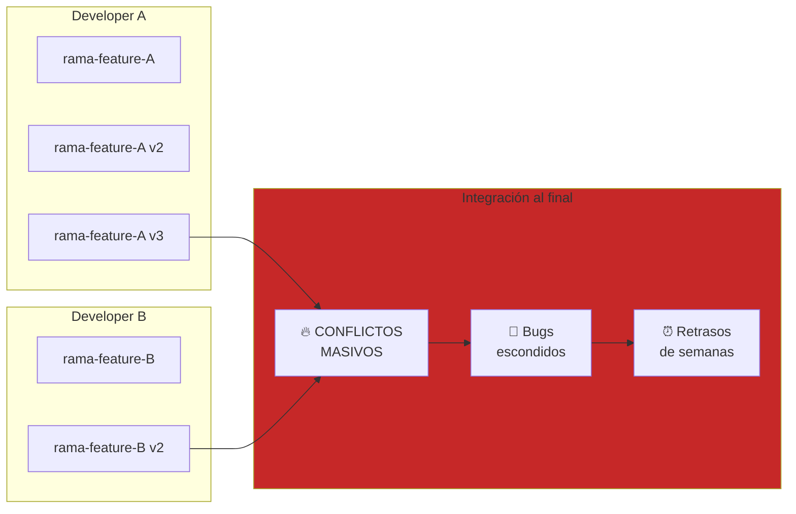
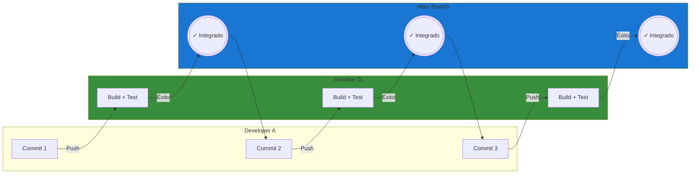
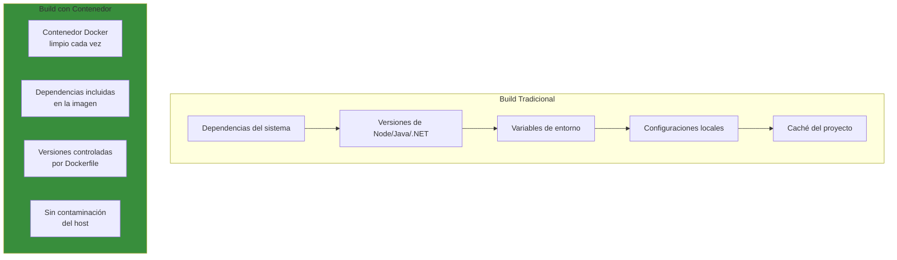
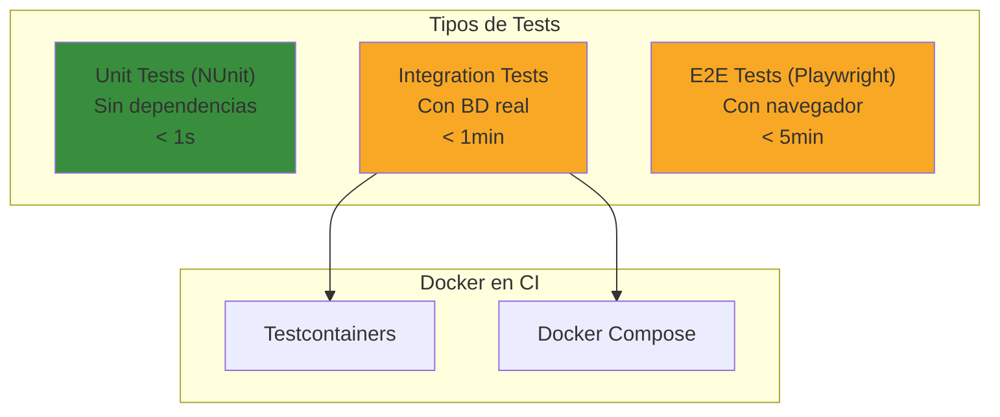
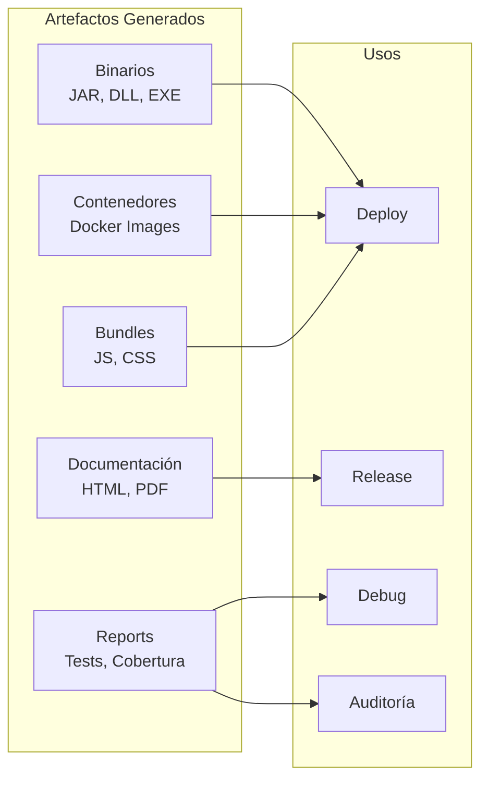

- [2. Profundizando en CI (Integración Continua)](#2-profundizando-en-ci-integración-continua)
  - [2.1. El concepto de "Falla rápido": Por qué integramos código varias veces al día](#21-el-concepto-de-falla-rápido-por-qué-integramos-código-varias-veces-al-día)
    - [2.1.1. El Problema de la Integración Tardía](#211-el-problema-de-la-integración-tardía)
    - [2.1.2. La Solución: Integración Frecuente](#212-la-solución-integración-frecuente)
    - [2.1.3. Beneficios del "Falla Rápido"](#213-beneficios-del-falla-rápido)
  - [2.2. Automatización de la Construcción (Build): Compilación en entornos limpios](#22-automatización-de-la-construcción-build-compilación-en-entornos-limpios)
    - [2.2.1. ¿Qué es el Build?](#221-qué-es-el-build)
    - [2.2.2. Entornos Limpios: La Magia del Contenedor](#222-entornos-limpios-la-magia-del-contenedor)
    - [2.2.3. 🛠️ Ejemplo: Build de .NET con GitHub Actions](#223-️-ejemplo-build-de-net-con-github-actions)
    - [2.2.4. 🛠️ Ejemplo: Build de Java con Gradle](#224-️-ejemplo-build-de-java-con-gradle)
    - [2.2.5. 🛠️ Ejemplo: Build de Node.js/npm](#225-️-ejemplo-build-de-nodejsnpm)
  - [2.3. Estrategias de Testing: Unitarios, integración y calidad de código (Linting)](#23-estrategias-de-testing-unitarios-integración-y-calidad-de-código-linting)
    - [2.3.1. Tests Unitarios en el Pipeline](#231-tests-unitarios-en-el-pipeline)
    - [2.3.2. Tests de Integración](#232-tests-de-integración)
    - [2.3.3. Análisis Estático y Linting](#233-análisis-estático-y-linting)
    - [🛠️ Linting y Análisis Estático para ASP.NET Core](#️-linting-y-análisis-estático-para-aspnet-core)
    - [🛠️ Configuración de Linting en GitHub Actions](#️-configuración-de-linting-en-github-actions)
  - [2.4. Artefactos: ¿Qué generamos tras una CI exitosa?](#24-artefactos-qué-generamos-tras-una-ci-exitosa)
    - [2.4.1. Tipos de Artefactos](#241-tipos-de-artefactos)
    - [2.4.2. Gestión de Artefactos con GitHub Actions](#242-gestión-de-artefactos-con-github-actions)
    - [2.4.3. Nombrado y Versionado de Artefactos](#243-nombrado-y-versionado-de-artefactos)
    - [2.4.4. 🛠️ Ejemplo Práctico: Pipeline con Artefactos](#244-️-ejemplo-práctico-pipeline-con-artefactos)
    - [Checklist de Supervivencia](#checklist-de-supervivencia)


# 2. Profundizando en CI (Integración Continua)

La **Integración Continua** (CI) es la práctica fundamental que sustenta todo el edificio de DevOps. Imagina que en lugar de esperar semanas para descubrir que tu código no funciona con el de tus compañeros, lo descubres en **minutos**, cada vez que haces un commit.

En este tema profundizaremos en los pilares de CI: la filosofía de "fallar rápido", la automatización del build, las estrategias de testing y la generación de artefactos.


## 2.1. El concepto de "Falla rápido": Por qué integramos código varias veces al día

### 2.1.1. El Problema de la Integración Tardía

En modelos de desarrollo tradicionales, los desarrolladores trabajaban en ramas aisladas durante días o semanas. Al final del sprint,intentaban integrar todo el código y... desastre:



**Problemas de la integración tardía:**

| Problema                    | Consecuencia                                     | Coste                  |
| --------------------------- | ------------------------------------------------ | ---------------------- |
| **Conflicts masivos**       | Resolución compleja y propensa a errores         | Días de trabajo        |
| **Bugs escondidos**         | Se descubren tarde cuando ya están propagados    | Multiplicador de coste |
| **Integración no probada**  | El código no funciona hasta último momento       | Frustración del equipo |
| **"Función en mi máquina"** | Diferencias de entorno causan fallos inesperados | Tiempo de debugging    |
| **Stress pre-release**      | El equipo trabaja noches antes del release       | Burnout                |

### 2.1.2. La Solución: Integración Frecuente

La Integración Continua propone un enfoque radicalmente diferente: **integramos constantemente, no una vez al final**.



**Flujo de trabajo con CI:**

1. El desarrollador hace cambios locales
2. Ejecuta los tests localmente (rápidos)
3. Hace commit y push a su rama
4. El servidor CI detecta el cambio automáticamente
5. Ejecuta la suite completa de tests
6. **Si todo pasa**: El código se integra a main
7. **Si falla**: El desarrollador es notificado inmediatamente

> **💡 Nota del Profesor**: "Falla rápido" no significa que queramos que fallen las builds. Significa que **queremos saber IMMEDIATAMENTE cuando algo falla**, para poder corregirlo mientras el contexto está fresco en nuestra mente. Un fallo que se descubre horas después es mucho más caro de corregir.

### 2.1.3. Beneficios del "Falla Rápido"

| Beneficio                      | Descripción                               | Ejemplo Práctico                                          |
| ------------------------------ | ----------------------------------------- | --------------------------------------------------------- |
| **Feedback inmediato**         | Sabrás en minutos si tu cambio rompe algo | No llegas al día siguiente a descubrir que todo está roto |
| **Contexto fresco**            | El error está en lo que acabas de cambiar | Sabes exactamente qué revertió o corrigió                 |
| **Integración continua**       | Main siempre está en estado desplegable   | Siempre se puede hacer release                            |
| **Reducción de deuda técnica** | Los problemas no se acumulan              | La deuda se paga según se contrae                         |
| **Confianza en main**          | Siempre puedes desplegar desde main       | Deploys sin miedo                                         |


## 2.2. Automatización de la Construcción (Build): Compilación en entornos limpios

### 2.2.1. ¿Qué es el Build?

El **build** es el proceso de transformar código fuente en artefactos ejecutables. Dependiendo del lenguaje y framework, esto puede incluir:

- **Compilación**: Traducir código fuente a bytecode/binario
- **Resolución de dependencias**: Descargar e instalar librerías
- **Bundling**: Empaquetar recursos (JS, CSS, imágenes)
- **Minificación**: Reducir tamaño de archivos
- **Transpilación**: Convertir código moderno a versiones compatibles

### 2.2.2. Entornos Limpios: La Magia del Contenedor

Uno de los principios fundamentales de CI es que **cada build debe ejecutarse en un entorno limpio y aislado**. Esto elimina el clásico problema de "funciona en mi máquina":



**Ventajas del entorno limpio:**

| Aspecto              | Entorno Sucio                  | Entorno Limpio           |
| -------------------- | ------------------------------ | ------------------------ |
| **Reproducibilidad** | Depende del estado del host    | Idéntico cada vez        |
| **Aislamiento**      | Conflictos entre proyectos     | Sin interferencias       |
| **Dependencias**     | "Se me olvidó instalar..."     | Incluidas en la imagen   |
| **Versiones**        | "En mi PC funciona con la v18" | Versión fija garantizada |

### 2.2.3. 🛠️ Ejemplo: Build de .NET con GitHub Actions

```yaml
name: Build .NET Application

on:
  push:
    branches: [ main, develop ]
  pull_request:
    branches: [ main ]

jobs:
  build:
    runs-on: ubuntu-latest
    
    steps:
      - name: Checkout code
        uses: actions/checkout@v4
      
      - name: Setup .NET
        uses: actions/setup-dotnet@v4
        with:
          dotnet-version: '10.0.x'
      
      - name: Restore dependencies
        run: dotnet restore
      
      - name: Build
        run: dotnet build --no-restore --configuration Release
      
      - name: Publish
        run: dotnet publish --no-build --configuration Release --output ./publish
```

### 2.2.4. 🛠️ Ejemplo: Build de Java con Gradle

```yaml
name: Build Java Application

on:
  push:
    branches: [ main ]
  pull_request:
    branches: [ main ]

jobs:
  build:
    runs-on: ubuntu-latest
    
    steps:
      - name: Checkout code
        uses: actions/checkout@v4
      
      - name: Setup Java
        uses: actions/setup-java@v4
        with:
          java-version: '21'
          distribution: 'temurin'
      
      - name: Cache Gradle
        uses: actions/cache@v4
        with:
          path: |
            ~/.gradle/caches
            ~/.gradle/wrapper
          key: ${{ runner.os }}-gradle-${{ hashFiles('**/*.gradle*') }}
          restore-keys: |
            ${{ runner.os }}-gradle-
      
      - name: Build with Gradle
        run: ./gradlew build
      
      - name: Build Docker Image
        run: docker build -t myapp:${{ github.sha }} .

```

### 2.2.5. 🛠️ Ejemplo: Build de Node.js/npm

```yaml
name: Build Node.js Application

on:
  push:
    branches: [ main ]
  pull_request:
    branches: [ main ]

jobs:
  build:
    runs-on: ubuntu-latest
    
    steps:
      - name: Checkout code
        uses: actions/checkout@v4
      
      - name: Setup Node.js
        uses: actions/setup-node@v4
        with:
          node-version: '20'
          cache: 'npm'
      
      - name: Install dependencies
        run: npm ci
      
      - name: Build
        run: npm run build
      
      - name: Run linter
        run: npm run lint
```

## 2.3. Estrategias de Testing: Unitarios, integración y calidad de código (Linting)

### 2.3.1. Tests Unitarios en el Pipeline

Los tests unitarios son la primera línea de defensa en el pipeline CI. Deben ejecutarse **en cada push** y ser **extremadamente rápidos**:

```yaml
- name: Run unit tests
  run: dotnet test --configuration Release --filter "FullyQualifiedName~Unit" --verbosity minimal
```

**Requisitos de los tests unitarios en CI:**

| Requisito        | Descripción               | Por qué importa        |
| ---------------- | ------------------------- | ---------------------- |
| **Velocidad**    | < 1 minuto total          | Feedback inmediato     |
| **Aislamiento**  | Sin dependencias externas | Sin flaky tests        |
| **Determinismo** | Mismo resultado siempre   | Confiabilidad          |
| **Cobertura**    | > 70% en código crítico   | Confianza en refactors |

### 2.3.2. Tests de Integración

Los tests de integración verifican que los componentes funcionan correctamente **juntos**:

```yaml
- name: Run integration tests
  run: dotnet test --configuration Release --filter "FullyQualifiedName~Integration"
```

**Consideraciones para tests de integración:**



### 2.3.3. Análisis Estático y Linting

El **linting** analiza el código sin ejecutarlo, verificando:
- Estilo y convenciones de código
- Code smells
- Patrones problemáticos conocidos
- Vulnerabilidades de seguridad

**Herramientas por lenguaje:**

| Lenguaje                  | Linter                                  | Análisis Estático   |
| ------------------------- | --------------------------------------- | ------------------- |
| **JavaScript/TypeScript** | ESLint, Prettier                        | SonarQube, CodeQL   |
| **Python**                | pylint, black                           | Pylint, Bandit      |
| **Java**                  | Checkstyle, Spotless                    | SonarQube, SpotBugs |
| **C# / .NET**             | StyleCop, .NET Analyzers, dotnet format | SonarQube, Roslyn   |
| **Go**                    | golint, gofmt                           | staticcheck         |

### 🛠️ Linting y Análisis Estático para ASP.NET Core

```yaml
# dotnet format - Verifica y corrige el estilo de código
- name: Check code formatting
  run: dotnet format --verify-no-changes --no-restore

# .NET Analyzers - Análisis estático integrado
- name: Run .NET analyzers
  run: dotnet build --no-restore -c Release

# SonarQube para .NET
- name: SonarQube Scan
  uses: SonarSource/sonarcloud-github-action@v2
  env:
    GITHUB_TOKEN: ${{ secrets.GITHUB_TOKEN }}
    SONAR_TOKEN: ${{ secrets.SONAR_TOKEN }}
  with:
    args: >
      sonar.projectKey=mi-proyecto
      sonar.projectName="Mi API ASP.NET Core"
      sonar.sources=src/
      sonar.language=cs
      sonar.dotnet.tests.summary=true
```

### 🛠️ Configuración de Linting en GitHub Actions

```yaml
# Para Node.js
- name: Run linter
  uses: wearerequired/linters@v1
  with:
    node_linter: eslint
    node_package_manager: npm
    node_version: '20'
    not_installed_package_manager_warning: info

- name: Run ESLint
  run: npm run lint -- --format json > eslint-results.json

- name: Annotate PR with ESLint errors
  uses: ataylorme/eslint-annotate-action@v2
  with:
    repo-token: ${{ secrets.GITHUB_TOKEN }}
    report-json: eslint-results.json

# Para .NET
- name: Build with code quality check
  run: |
    dotnet format --verify-no-changes --no-restore
    dotnet build --no-restore -c Release

```
## 2.4. Artefactos: ¿Qué generamos tras una CI exitosa?

### 2.4.1. Tipos de Artefactos

Un **artefacto** es cualquier archivo generado durante el proceso de build que queremos conservar para etapas posteriores o despliegues:



### 2.4.2. Gestión de Artefactos con GitHub Actions

```yaml
- name: Upload build artifacts
  uses: actions/upload-artifact@v4
  with:
    name: build-output
    path: ./bin/Release/net10.0/
    retention-days: 7

- name: Upload test results
  uses: actions/upload-artifact@v4
  with:
    name: test-results
    path: TestResults/
    retention-days: 30

- name: Upload coverage report
  uses: actions/upload-artifact@v4
  with:
    name: coverage-report
    path: coverage-report/
    retention-days: 7
```

**Descargar artefactos en jobs posteriores:**

```yaml
- name: Download build artifacts
  uses: actions/download-artifact@v4
  with:
    name: build-output
    path: ./bin/Release/net10.0/
```

### 2.4.3. Nombrado y Versionado de Artefactos

**Convention sobre configuración:**

```yaml
- name: Upload build artifacts
  uses: actions/upload-artifact@v4
  with:
    name: ${{ github.job }}-${{ matrix.os }}-${{ matrix.dotnet-version }}
    path: ./publish/
```

| Tipo             | Ejemplo de nombre                   | Cuándo usarlo |
| ---------------- | ----------------------------------- | ------------- |
| **Build output** | `app-v1.2.3.zip`                    | Deploys       |
| **Docker image** | `myapp:${{ github.sha }}`           | Contenedores  |
| **Test results** | `test-results-${{ github.run_id }}` | Debugging     |
| **Coverage**     | `coverage-report`                   | Revisiones    |

### 2.4.4. 🛠️ Ejemplo Práctico: Pipeline con Artefactos

```yaml
name: CI Pipeline with Artifacts

on:
  push:
    branches: [ main ]

jobs:
  build:
    runs-on: ubuntu-latest
    
    steps:
      - uses: actions/checkout@v4
      
      - name: Setup .NET
        uses: actions/setup-dotnet@v4
        with:
          dotnet-version: '10.0.x'
      
      - name: Build
        run: dotnet build --configuration Release
      
      - name: Run tests
        run: dotnet test --configuration Release --no-build --collect:"XPlat Code Coverage"
      
      - name: Publish
        run: dotnet publish --configuration Release --no-build --output ./publish
      
      - name: Upload app artifact
        uses: actions/upload-artifact@v4
        with:
          name: app
          path: publish/
      
      - name: Upload test results
        uses: actions/upload-artifact@v4
        with:
          name: test-results
          path: TestResults/
      
      - name: Generate coverage report
        run: |
          reportgenerator "-reports:TestResults/**/coverage.cobertura.xml" "-targetdir:coveragereport" -reporttypes:Html
      - name: Upload coverage report
        uses: actions/upload-artifact@v4
        with:
          name: coverage-report
          path: coveragereport/
```

---

> **💡 Nota del Profesor**: Los artefactos son la prueba tangible de que tu build fue exitosa. Guarda los suficientes para poder debuggear problemas en producción, pero no tantos que ocupe todo el storage. 7 días para artefactos de build y 30 días para resultados de tests suele ser un buen balance.

---

### Checklist de Supervivencia

- [ ] Entiendo por qué "fallar rápido" es beneficial a largo plazo
- [ ] Sé qué es el build y por qué debe ejecutarse en entornos limpios
- [ ] Puedo configurar un pipeline de build para .NET, Java y Node.js
- [ ] Conozco la diferencia entre tests unitarios, integración y E2E en el pipeline
- [ ] Sé configurar linting y análisis estático en GitHub Actions
- [ ] Puedo configurar la subida y descarga de artefactos
