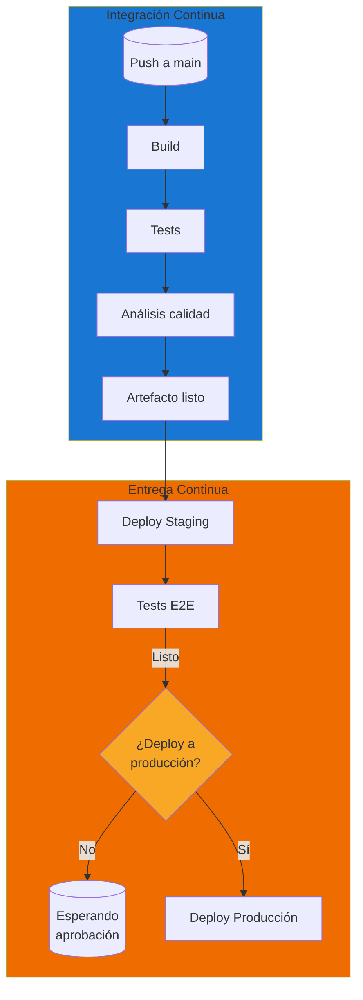
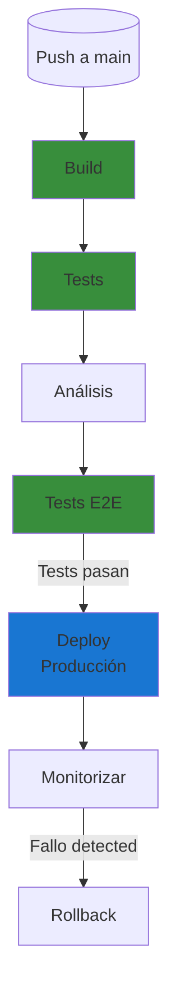
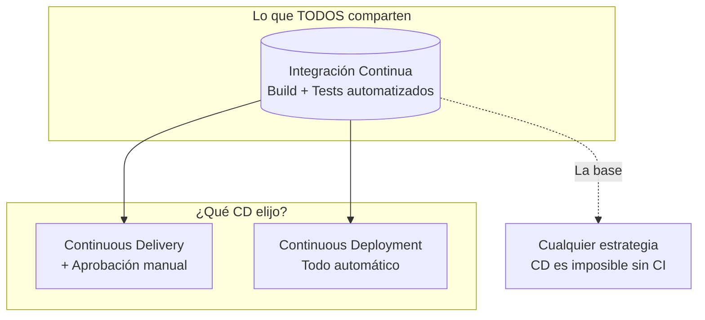
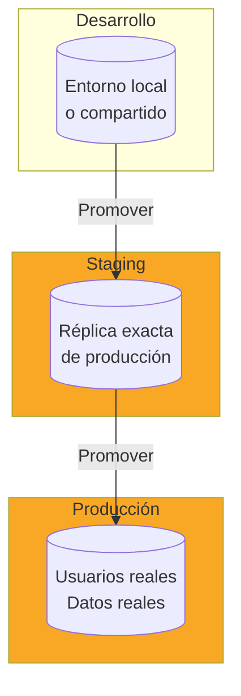
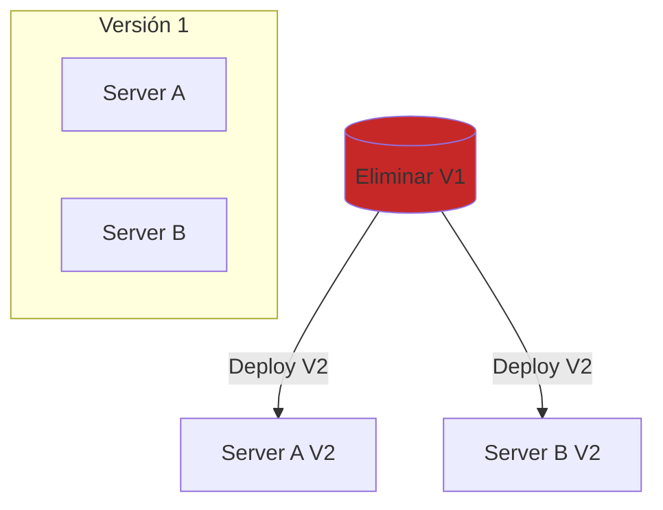
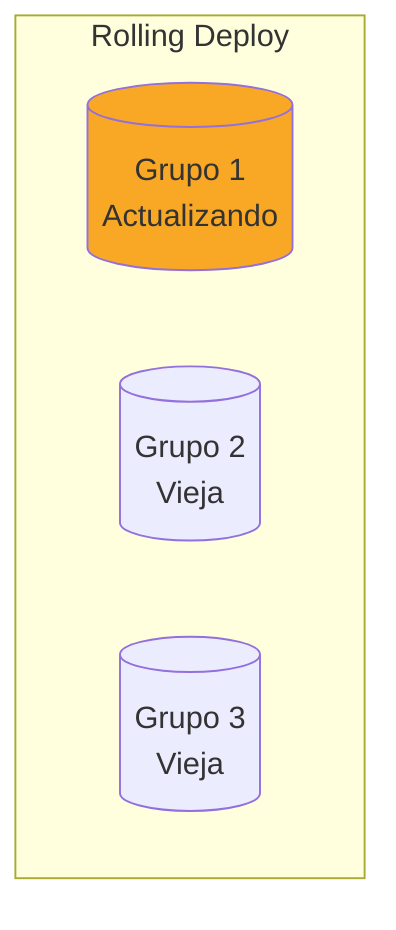
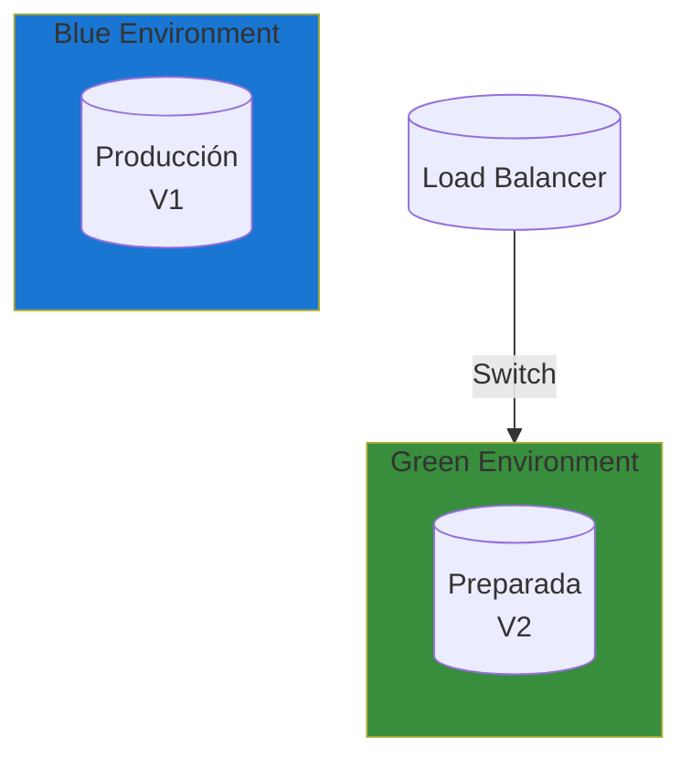
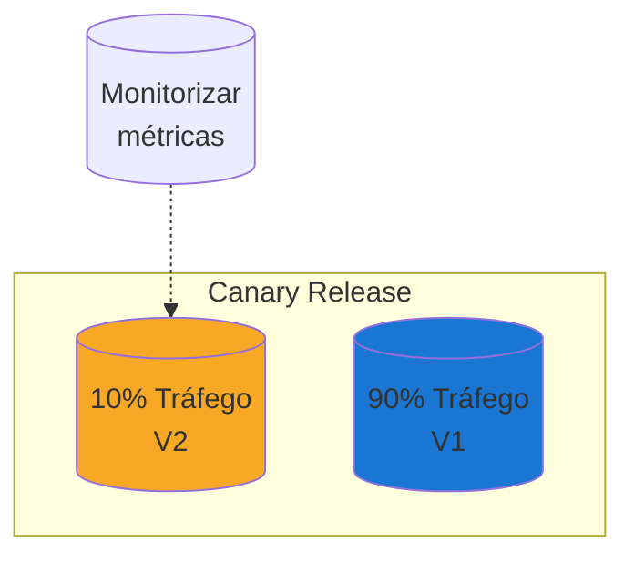

- [3. Profundizando en CD (Entrega y Despliegue Continuo)](#3-profundizando-en-cd-entrega-y-despliegue-continuo)
  - [3.1. Continuous Delivery vs. Continuous Deployment: El matiz del "botón manual"](#31-continuous-delivery-vs-continuous-deployment-el-matiz-del-botón-manual)
    - [3.1.1. Continuous Delivery (CD): Listo para producción](#311-continuous-delivery-cd-listo-para-producción)
    - [3.1.2. Continuous Deployment: Despliegue automático](#312-continuous-deployment-despliegue-automático)
    - [3.1.3. Continuous Integration: La base de todo](#313-continuous-integration-la-base-de-todo)
  - [3.2. Diferencias y Similitudes: Tabla comparativa de objetivos y procesos](#32-diferencias-y-similitudes-tabla-comparativa-de-objetivos-y-procesos)
  - [3.3. Entornos: Desarrollo, Staging (Pre-producción) y Producción](#33-entornos-desarrollo-staging-pre-producción-y-producción)
    - [3.3.1. Entorno de Desarrollo](#331-entorno-de-desarrollo)
    - [3.3.2. Entorno de Staging (Pre-producción)](#332-entorno-de-staging-pre-producción)
    - [3.3.3. Entorno de Producción](#333-entorno-de-producción)
    - [3.3.4. 🛠️ Configuración de Environments en GitHub Actions](#334-️-configuración-de-environments-en-github-actions)
  - [3.4. Aprobaciones y Gates: El control humano en CD](#34-aprobaciones-y-gates-el-control-humano-en-cd)
    - [3.4.1. Environment Protection Rules](#341-environment-protection-rules)
    - [3.4.2. Required Reviewers](#342-required-reviewers)
    - [3.4.3. Wait Timer](#343-wait-timer)
  - [3.5. Estrategias de Despliegue](#35-estrategias-de-despliegue)
    - [3.5.1. Despliegue Recreativo (Recreate)](#351-despliegue-recreativo-recreate)
    - [3.5.2. Despliegue Rolling](#352-despliegue-rolling)
    - [3.5.3. Blue-Green Deployment](#353-blue-green-deployment)
    - [3.5.4. Canary Release](#354-canary-release)
    - [Checklist de Supervivencia](#checklist-de-supervivencia)


# 3. Profundizando en CD (Entrega y Despliegue Continuo)

La **Entrega Continua** (CD) y el **Despliegue Continuo** extienden los principios de CI un paso más allá. Si CI asegura que el código está integrado correctamente, CD asegura que ese código integrado **puede llegar a producción de forma segura y automatizada**.

La distinción entre "Entrega" y "Despliegue" es sutil pero crucial: una requiere intervención humana, la otra no.


## 3.1. Continuous Delivery vs. Continuous Deployment: El matiz del "botón manual"

### 3.1.1. Continuous Delivery (CD): Listo para producción

**Continuous Delivery** significa que cada cambio que pasa el pipeline CI está **listo para ir a producción** en cualquier momento, pero requiere una **aprobación humana** para el despliegue final.



**Características clave:**

| Aspecto              | Descripción                                    |
| -------------------- | ---------------------------------------------- |
| **Automatización**   | Build, test y deploy a staging son automáticos |
| **Control humano**   | El deploy a producción requiere aprobación     |
| **State "ready"**    | El software siempre está en estado desplegable |
| **Release decision** | El negocio decide cuándo hacer el release      |

**Cuándo usar Continuous Delivery:**

- ✅ Cuando necesitas coordinar con marketing para features
- ✅ En industrias reguladas que requieren aprobación manual
- ✅ Cuando los ciclos de release no son diarios
- ✅ Cuando tienes múltiples entornos (QA, UAT, Producción)

### 3.1.2. Continuous Deployment: Despliegue automático

**Continuous Deployment** lleva CD un paso más allá: **cada cambio que pasa todos los tests se despliega automáticamente a producción** sin intervención humana.



**Requisitos para Continuous Deployment:**

| Requisito               | Descripción                                  | Por qué importa                       |
| ----------------------- | -------------------------------------------- | ------------------------------------- |
| **Tests exhaustivos**   | Cobertura > 80%, tests E2E robustos          | No hay humano verificando             |
| **Monitoreo avanzado**  | Alertas automáticas, métricas en tiempo real | Detectar problemas rápido             |
| **Rollback automático** | Capacidad de revertir en segundos            | Minimizar impacto de fallos           |
| **Feature flags**       | Activar/desactivar features sin deploy       | Detención de emergencia funcionalidad |
| **Cultura de calidad**  | Todo el equipo comprometido                  | Cada commit es un release             |

**Cuándo usar Continuous Deployment:**

- ✅ Servicios internos donde el impacto es controlado
- ✅ Empresas "born in the cloud"
- ✅ Cuando puedes tolerar bugs menores (y revertirlos rápido)
- ✅ Equipos con alta madurez en testing y monitoreo

### 3.1.3. Continuous Integration: La base de todo

No importa si eliges Delivery o Deployment, **ambos requieren CI** como base:




## 3.2. Diferencias y Similitudes: Tabla comparativa de objetivos y procesos

| Aspecto                   | Continuous Integration | Continuous Delivery | Continuous Deployment |
| ------------------------- | ---------------------- | ------------------- | --------------------- |
| **Frecuencia de commits** | Múltiples al día       | Múltiples al día    | Múltiples al día      |
| **Build automatizado**    | ✅ Sí                   | ✅ Sí                | ✅ Sí                  |
| **Tests automatizados**   | ✅ Sí                   | ✅ Sí                | ✅ Sí                  |
| **Deploy a staging**      | ✅ Sí                   | ✅ Sí                | ✅ Sí                  |
| **Deploy a producción**   | ❌ No                   | ⚠️ Con aprobación    | ✅ Automático          |
| **Requiere tests E2E**    | ⚠️ Opcional             | ✅ Recomendado       | ✅ Obligatorio         |
| **Requiere monitoreo**    | ⚠️ Básico               | ✅ Completo          | ✅ Completo + alertas  |
| **Cultura necesaria**     | Media                  | Alta                | Muy alta              |
| **Riesgo por cambio**     | Bajo                   | Medio               | Alto mitigado         |

> **💡 Nota del Profesor**: La mayoría de los equipos начина con CI + CD (Delivery), no Deployment. Continuous Deployment requiere una madurez que toma meses o años desarrollar. No hay vergüenza en tener aprobación manual; lo importante es que el software siempre esté listo para desplegarse.


## 3.3. Entornos: Desarrollo, Staging (Pre-producción) y Producción

### 3.3.1. Entorno de Desarrollo

| Aspecto           | Descripción                         |
| ----------------- | ----------------------------------- |
| **Propósito**     | Desarrollo local y pruebas rápidas  |
| **Acceso**        | Todos los desarrolladores           |
| **Datos**         | Datos de prueba, a veces sintéticos |
| **Configuración** | Flexible, puede cambiarse           |
| **Estabilidad**   | Variable, se espera que Rompa       |

### 3.3.2. Entorno de Staging (Pre-producción)



| Aspecto           | Descripción                    |
| ----------------- | ------------------------------ |
| **Propósito**     | Validación antes de producción |
| **Acceso**        | Desarrolladores + QA + Product |
| **Datos**         | Anonymizados de producción     |
| **Configuración** | Idéntica a producción          |
| **Estabilidad**   | Alta, refleja producción       |

### 3.3.3. Entorno de Producción

| Aspecto           | Descripción             |
| ----------------- | ----------------------- |
| **Propósito**     | Uso por usuarios reales |
| **Acceso**        | Restringido, solo ops   |
| **Datos**         | Reales y sensibles      |
| **Configuración** | Estricta, auditada      |
| **Estabilidad**   | Crítica, 99.9% uptime   |

### 3.3.4. 🛠️ Configuración de Environments en GitHub Actions

```yaml
name: Deploy to Staging and Production

on:
  push:
    branches: [ main ]

jobs:
  deploy-staging:
    runs-on: ubuntu-latest
    environment: staging
    steps:
      - name: Deploy to Staging
        run: echo "Deploying to staging..."
  
  deploy-production:
    needs: deploy-staging
    runs-on: ubuntu-latest
    environment: production
    steps:
      - name: Deploy to Production
        run: echo "Deploying to production..."
```


## 3.4. Aprobaciones y Gates: El control humano en CD

### 3.4.1. Environment Protection Rules

GitHub permite configurar protecciones en environments:

```yaml
environment:
  name: production
  url: https://app.example.com
```

### 3.4.2. Required Reviewers

```yaml
environment:
  name: production
  url: https://app.example.com
  required_reviewers:
    - tech-lead-1
    - tech-lead-2
```

### 3.4.3. Wait Timer

```yaml
environment:
  name: production
  url: https://app.example.com
  required_reviewers: 1
  wait_timer: 900  # 15 minutos antes de poder approve
```


## 3.5. Estrategias de Despliegue

### 3.5.1. Despliegue Recreativo (Recreate)



**Pros:**
- ✅ Simple de implementar
- ✅ Sin coste adicional de infraestructura

**Contras:**
- ❌ Downtime durante el deploy
- ❌ Riesgo alto si algo falla

### 3.5.2. Despliegue Rolling



**Pros:**
- ✅ Sin downtime
- ✅ Deploy gradual
- ✅ Rollback rápido

**Contras:**
- ❌ Más complejo de implementar
- ❌ Incompatible con algunos cambios de BD

### 3.5.3. Blue-Green Deployment



**Pros:**
- ✅ Rollback instantáneo
- ✅ Testing completo antes del switch
- ✅ Sin downtime

**Contras:**
- ❌ Duplica coste de infraestructura
- ❌ Requiere capacidad extra

### 3.5.4. Canary Release



**Pros:**
- ✅ Detección temprana de problemas
- ✅ Exposure gradual
- ✅ Rollback automático si métricas caen

**Contras:**
- ❌ Requiere infraestructura compleja
- ❌ Routing por porcentaje necesario

---

> **💡 Nota del Profesor**: La estrategia de despliegue debe adaptarse al riesgo de tu aplicación y la tolerancia de tu negocio. Empieza con Recreate o Rolling, y evoluciona hacia Blue-Green o Canary cuando tu aplicación y equipo estén listos.

---

### Checklist de Supervivencia

- [ ] Puedo explicar la diferencia entre Continuous Integration, Delivery y Deployment
- [ ] Sé cuándo usar cada tipo de CD según el contexto
- [ ] Conozco los tres entornos típicos y su propósito
- [ ] Puedo configurar Environment Protection en GitHub Actions
- [ ] Conozco las estrategias de despliegue y sus pros/contras
- [ ] Entiendo cuándo usar aprobación manual vs. despliegue automático
