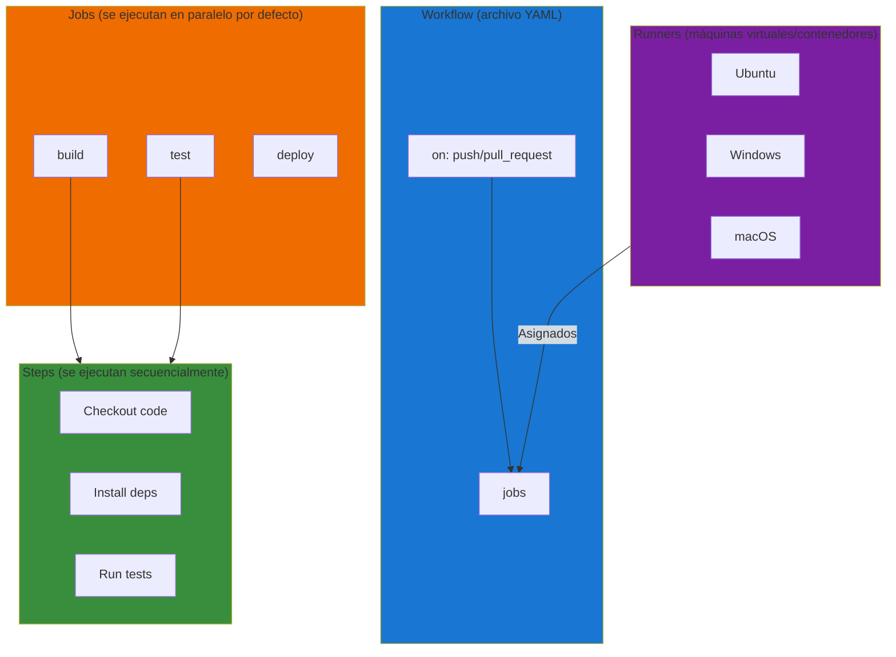
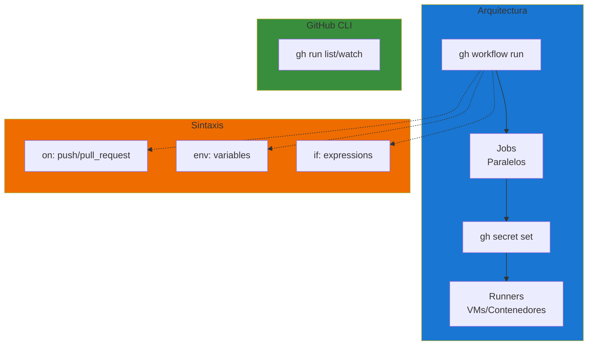

- [4. Herramientas: GitHub Actions y GitHub CLI](#4-herramientas-github-actions-y-github-cli)
  - [4.1. Arquitectura de GitHub Actions: Workflows, Jobs, Steps y Runners](#41-arquitectura-de-github-actions-workflows-jobs-steps-y-runners)
    - [4.1.1. Workflow: La definición completa del proceso](#411-workflow-la-definición-completa-del-proceso)
    - [4.1.2. Jobs: Unidades de ejecución](#412-jobs-unidades-de-ejecución)
    - [4.1.3. Steps: Tareas individuales](#413-steps-tareas-individuales)
    - [🛠️ Ejemplo: Steps para .NET 10 con C# 14](#️-ejemplo-steps-para-net-10-con-c-14)
    - [4.1.4. Runners: Entornos de ejecución](#414-runners-entornos-de-ejecución)
  - [4.2. Sintaxis YAML: Estructura de un archivo de configuración](#42-sintaxis-yaml-estructura-de-un-archivo-de-configuración)
    - [4.2.1. Anatomía de un Workflow](#421-anatomía-de-un-workflow)
    - [4.2.2. Eventos que disparan workflows](#422-eventos-que-disparan-workflows)
    - [4.2.3. Condiciones y expresiones](#423-condiciones-y-expresiones)
    - [4.2.4. 🛠️ Ejemplo completo de Workflow](#424-️-ejemplo-completo-de-workflow)
  - [4.3. GitHub CLI (gh): Controlando pipelines desde la terminal](#43-github-cli-gh-controlando-pipelines-desde-la-terminal)
    - [4.3.1. Instalación de GitHub CLI](#431-instalación-de-github-cli)
    - [4.3.2. Comandos esenciales para CI/CD](#432-comandos-esenciales-para-cicd)
    - [4.3.3. Gestión de secretos desde la terminal](#433-gestión-de-secretos-desde-la-terminal)
    - [4.3.4. Visualización de logs sin salir del IDE](#434-visualización-de-logs-sin-salir-del-ide)
  - [Resumen del Tema](#resumen-del-tema)
    - [Checklist de Supervivencia](#checklist-de-supervivencia)


# 4. Herramientas: GitHub Actions y GitHub CLI

**GitHub Actions** es el sistema de CI/CD nativo de GitHub, integrado perfectamente con tu repositorio. **GitHub CLI** (gh) te permite controlar todo esto desde la terminal, sin salir de tu flujo de trabajo habitual.

En este tema aprenderás la arquitectura de GitHub Actions, la sintaxis YAML que define tus pipelines, y cómo automatizar tu productividad con gh.


## 4.1. Arquitectura de GitHub Actions: Workflows, Jobs, Steps y Runners

GitHub Actions tiene una arquitectura modular que entenderás en segundos:



### 4.1.1. Workflow: La definición completa del proceso

Un **workflow** es un proceso automatizado que defines mediante un archivo YAML. Se ejecuta en respuesta a eventos y puede contener uno o más jobs.

**Ubicación obligatoria:**
```
.github/workflows/*.yml
```

### 4.1.2. Jobs: Unidades de ejecución

Un **job** es un conjunto de steps que se ejecutan en el mismo runner. Por defecto, los jobs se ejecutan en **paralelo**:

```yaml
jobs:
  build:      # Job 1
    runs-on: ubuntu-latest
    steps:
      - name: Build
        run: echo "Building..."
  
  test:       # Job 2 (paralelo a build)
    runs-on: ubuntu-latest
    steps:
      - name: Test
        run: echo "Testing..."
  
  deploy:     # Job 3 (espera a build y test)
    needs: [build, test]
    runs-on: ubuntu-latest
    steps:
      - name: Deploy
        run: echo "Deploying..."
```

**Características de los Jobs:**

| Característica   | Descripción                                          |
| ---------------- | ---------------------------------------------------- |
| **Paralelismo**  | Se ejecutan simultáneamente por defecto              |
| **Dependencias** | `needs: [job]` para esperar a otros                  |
| **Entorno**      | Cada job tiene su entorno aislado                    |
| **Artifacts**    | Pueden compartir archivos mediante uploads/downloads |
| **Timeout**      | Se puede configurar timeout-minutes                  |

### 4.1.3. Steps: Tareas individuales

Un **step** es una tarea individual dentro de un job. Puede ser:

- Un **comando de shell** (`run:`)
- Una **acción** (`uses:`)

```yaml
steps:
  # Step 1: Usar una acción pre-construida
  - name: Checkout code
    uses: actions/checkout@v4
  
  # Step 2: Instalar dependencias (Node.js)
  - name: Install dependencies
    run: npm ci
  
  # Step 3: Ejecutar build
  - name: Build
    run: npm run build
  
  # Step 4: Ejecutar tests
  - name: Run tests
    run: npm test
```

### 🛠️ Ejemplo: Steps para .NET 10 con C# 14

```yaml
steps:
  # Step 1: Checkout del código fuente
  - name: Checkout code
    uses: actions/checkout@v4
  
  # Step 2: Instalar SDK de .NET 10
  - name: Setup .NET 10
    uses: actions/setup-dotnet@v4
    with:
      dotnet-version: '10.0.x'
  
  # Step 3: Restaurar dependencias
  - name: Restore dependencies
    run: dotnet restore
  
  # Step 4: Compilar en Release
  - name: Build
    run: dotnet build --configuration Release --no-restore
  
  # Step 5: Ejecutar tests unitarios
  - name: Run unit tests
    run: dotnet test --configuration Release --filter "FullyQualifiedName~Unit" --verbosity minimal
  
  # Step 6: Ejecutar tests de integración
  - name: Run integration tests
    run: dotnet test --configuration Release --filter "FullyQualifiedName~Integration" --verbosity minimal
  
  # Step 7: Generar cobertura con Coverlet
  - name: Generate coverage report
    run: dotnet test --configuration Release --collect:"XPlat Code Coverage"
```

### 4.1.4. Runners: Entornos de ejecución

Un **runner** es la máquina virtual donde se ejecutan tus jobs:

| Runner             | Sistema            | Cuándo usarlo                        |
| ------------------ | ------------------ | ------------------------------------ |
| **ubuntu-latest**  | Ubuntu 22.04       | Default para la mayoría              |
| **windows-latest** | Windows 2022       | Proyectos .NET, aplicaciones Windows |
| **macos-latest**   | macOS 14           | Proyectos iOS/macOS                  |
| **self-hosted**    | Tu propio servidor | Cuando necesitas hardware específico |

```yaml
jobs:
  linux-build:
    runs-on: ubuntu-latest
    steps:
      - name: Build on Linux
        run: echo "Building on Ubuntu"
  
  windows-build:
    runs-on: windows-latest
    steps:
      - name: Build on Windows
        run: echo "Building on Windows"
```


## 4.2. Sintaxis YAML: Estructura de un archivo de configuración

### 4.2.1. Anatomía de un Workflow

```yaml
# 1. Nombre del workflow
name: CI Pipeline

# 2. Eventos que disparan el workflow
on:
  push:
    branches: [ main, develop ]
  pull_request:
    branches: [ main ]

# 3. Variables de entorno globales
env:
  DOTNET_VERSION: '10.0.x'
  NODE_VERSION: '20'

# 4. Definición de jobs
jobs:
  build:
    name: Build and Test
    runs-on: ubuntu-latest
    
    steps:
      - name: Checkout
        uses: actions/checkout@v4
      
      - name: Setup .NET
        uses: actions/setup-dotnet@v4
        with:
          dotnet-version: ${{ env.DOTNET_VERSION }}
      
      - name: Build
        run: dotnet build --configuration Release
      
      - name: Test
        run: dotnet test --configuration Release --no-build
```

### 4.2.2. Eventos que disparan workflows

```yaml
on:
  # Push a ramas específicas
  push:
    branches: [ main, develop ]
    paths-ignore:
      - 'docs/**'
      - '**.md'
  
  # Pull requests
  pull_request:
    branches: [ main ]
  
  # Workflow manual
  workflow_dispatch:
    inputs:
      environment:
        description: 'Environment to deploy'
        required: true
        type: choice
        options:
          - staging
          - production
  
  # Programado (cron)
  schedule:
    - cron: '0 2 * * *'  # Cada día a las 2 AM UTC
  
  # Tags
  push:
    tags:
      - 'v*'
```

### 4.2.3. Condiciones y expresiones

```yaml
jobs:
  deploy:
    runs-on: ubuntu-latest
    # Solo ejecutar en main
    if: github.ref == 'refs/heads/main'
    
    steps:
      - name: Deploy
        run: echo "Deploying..."
        # Continuar aunque falle
        continue-on-error: false
```

**Expresiones comunes:**

| Expresión           | Descripción                         |
| ------------------- | ----------------------------------- |
| `github.ref`        | Rama o tag actual                   |
| `github.event_name` | Tipo de evento (push, pull_request) |
| `needs.job.result`  | Resultado de un job dependiente     |
| `env.VAR`           | Variable de entorno                 |
| `secrets.SECRET`    | Secreto                             |

### 4.2.4. 🛠️ Ejemplo completo de Workflow

```yaml
name: Full CI/CD Pipeline

on:
  push:
    branches: [ main ]
  pull_request:
    branches: [ main ]

env:
  DOTNET_VERSION: '10.0.x'

jobs:
  build:
    runs-on: ubuntu-latest
    
    steps:
      - uses: actions/checkout@v4
      
      - name: Setup .NET
        uses: actions/setup-dotnet@v4
        with:
          dotnet-version: ${{ env.DOTNET_VERSION }}
      
      - name: Restore dependencies
        run: dotnet restore
      
      - name: Build
        run: dotnet build --configuration Release --no-restore
      
      - name: Test
        run: dotnet test --configuration Release --no-build --verbosity minimal
      
      - name: Upload build artifacts
        uses: actions/upload-artifact@v4
        with:
          name: build-output
          path: bin/Release/net10.0/
          retention-days: 7
  
  deploy-staging:
    needs: build
    runs-on: ubuntu-latest
    environment: staging
    steps:
      - name: Download artifacts
        uses: actions/download-artifact@v4
        with:
          name: build-output
          path: bin/Release/net10.0/
      
      - name: Deploy to Staging
        run: echo "Deploying to staging..."
  
  deploy-production:
    needs: deploy-staging
    runs-on: ubuntu-latest
    environment: production
    steps:
      - name: Deploy to Production
        run: echo "Deploying to production..."
```


## 4.3. GitHub CLI (gh): Controlando pipelines desde la terminal

### 4.3.1. Instalación de GitHub CLI

```bash
# Windows (con scoop)
scoop install gh

# macOS (con Homebrew)
brew install gh

# Linux (Debian/Ubuntu)
sudo apt install gh

# Verificar instalación
gh --version
```

**Autenticación:**

```bash
gh auth login
```

### 4.3.2. Comandos esenciales para CI/CD

```bash
# Ver workflows disponibles
gh workflow list

# Ver estado de un workflow
gh workflow view ci.yml

# Ejecutar workflow manualmente
gh workflow run ci.yml

# Ver historial de ejecuciones
gh run list --limit 10

# Ver ejecución específica
gh run view <run-id>

# Ver logs en tiempo real
gh run watch <run-id> --exit-status

# Cancelar ejecución
gh run cancel <run-id>

# Re-ejecutar fallido
gh run rerun <run-id>
```

### 4.3.3. Gestión de secretos desde la terminal

```bash
# Listar secretos
gh secret list

# Establecer secreto
gh secret set DATABASE_URL

# Establecer secreto desde valor
gh secret set API_KEY --body "mi-api-key"

# Eliminar secreto
gh secret remove DATABASE_URL
```

### 4.3.4. Visualización de logs sin salir del IDE

```bash
# Obtener ID de última ejecución
RUN_ID=$(gh run list -L1 --jq '.[0].id')

# Ver resumen
gh run view $RUN_ID

# Ver jobs
gh run view $RUN_ID --json jobs

# Ver logs de un job específico
gh run view $RUN_ID --job=<job-id> --log

# Buscar errores en logs
gh run view $RUN_ID --log | grep -i error

# Descargar artefactos
gh run download $RUN_ID -D ./artefactos
```

**Script completo para monitoreo:**

```bash
#!/bin/bash
# monitor-run.sh - Monitorea la ejecución actual

# Obtener última ejecución
RUN_ID=$(gh run list -L1 --jq '.[0].id')
echo "Monitoreando ejecución: $RUN_ID"

# Ver progreso en tiempo real
gh run watch $RUN_ID --exit-status
```


## Resumen del Tema



---

> **💡 Nota del Profesor**: GitHub Actions se ha convertido en el estándar de la industria para CI/CD. Su integración nativa con GitHub elimina la complejidad de configurar webhooks externos. GitHub CLI te permite mantener el mismo flujo de trabajo en la terminal, lo que es ideal para equipos que prefieren el CLI sobre la UI.

---

### Checklist de Supervivencia

- [ ] Puedo explicar la jerarquía: Workflow → Jobs → Steps → Runners
- [ ] Sé crear un workflow básico en YAML
- [ ] Conozco los diferentes tipos de triggers (push, PR, schedule, manual)
- [ ] Puedo configurar jobs paralelos y con dependencias
- [ ] Sé usar GitHub CLI para monitorear ejecuciones
- [ ] Puedo gestionar secretos desde la terminal
