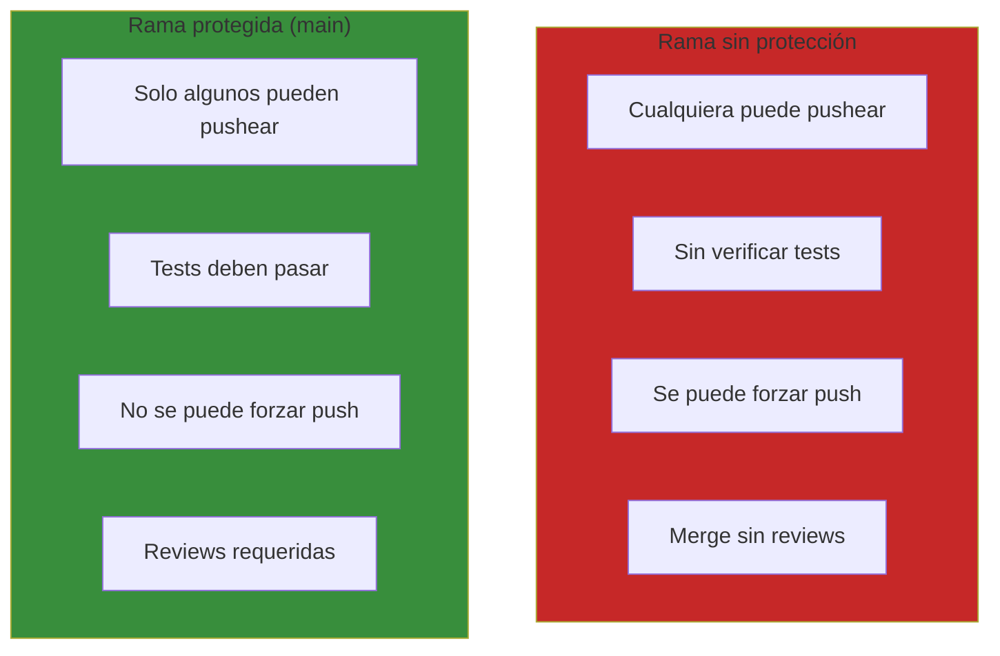
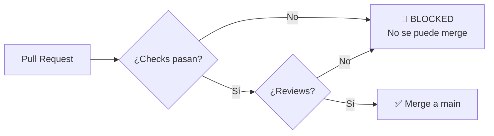
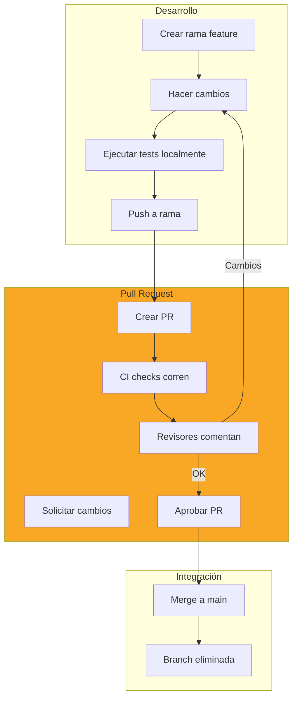
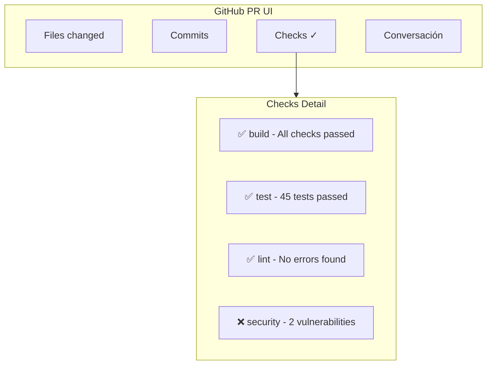
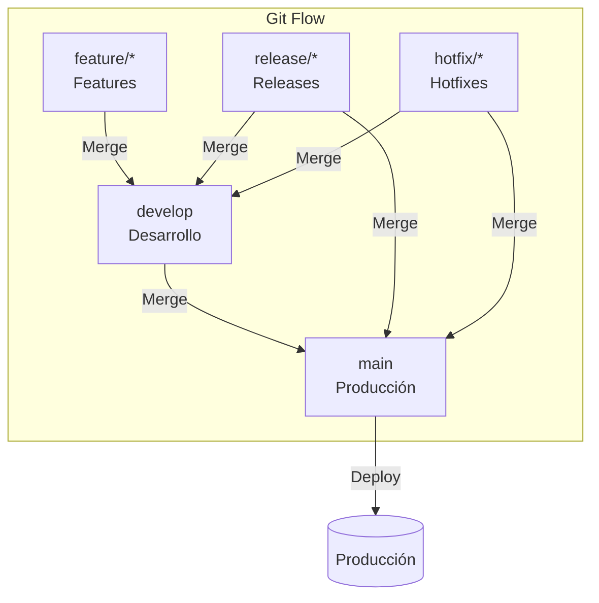
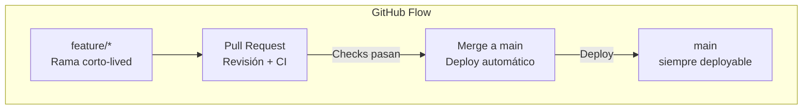
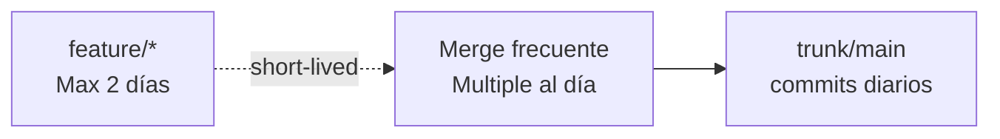

- [5. Asegurando la Calidad: El "Gatekeeper"](#5-asegurando-la-calidad-el-gatekeeper)
  - [5.1. Protección de Ramas (Branch Protection)](#51-protección-de-ramas-branch-protection)
    - [5.1.1. ¿Por qué proteger ramas?](#511-por-qué-proteger-ramas)
    - [5.1.2. Configuración de Branch Protection Rules](#512-configuración-de-branch-protection-rules)
    - [5.1.3. 🛠️ Required Status Checks: El filtro automático](#513-️-required-status-checks-el-filtro-automático)
    - [5.1.4. 🛠️ Bloqueo de fusión a main: Impedir el merge si los tests fallan](#514-️-bloqueo-de-fusión-a-main-impedir-el-merge-si-los-tests-fallan)
    - [5.1.5. Restricciones adicionales](#515-restricciones-adicionales)
  - [5.2. Pull Requests como disparadores: Revisión de código obligatoria y automatizada](#52-pull-requests-como-disparadores-revisión-de-código-obligatoria-y-automatizada)
    - [5.2.1. El flujo de trabajo con Pull Requests](#521-el-flujo-de-trabajo-con-pull-requests)
    - [5.2.2. Configuración de Pull Request Rules](#522-configuración-de-pull-request-rules)
    - [5.2.3. Revisiones requeridas y Code Owners](#523-revisiones-requeridas-y-code-owners)
    - [5.2.4. Automatización en el Pull Request](#524-automatización-en-el-pull-request)
  - [5.3. GitHub Checks: Integración profunda con el pipeline](#53-github-checks-integración-profunda-con-el-pipeline)
    - [5.3.1. ¿Qué son los Checks?](#531-qué-son-los-checks)
    - [5.3.2. Configurar Checks en el workflow](#532-configurar-checks-en-el-workflow)
    - [5.3.3. Anotaciones automáticas en el PR](#533-anotaciones-automáticas-en-el-pr)
  - [5.4. Estrategias de Branching](#54-estrategias-de-branching)
    - [5.4.1. Git Flow](#541-git-flow)
    - [5.4.2. GitHub Flow](#542-github-flow)
    - [5.4.3. Trunk-Based Development](#543-trunk-based-development)
    - [Checklist de Supervivencia](#checklist-de-supervivencia)


# 5. Asegurando la Calidad: El "Gatekeeper"

En el mundo de DevOps, no confiamos ciegamente en que los desarrolladores recordarán ejecutar los tests o seguir los estándares de código. **Automatizamos la calidad** mediante protecciones que impiden que código defectuoso llegue a ramas protegidas.

En este tema aprenderás a configurar GitHub como un "guardián" que vela por la calidad de tu código.


## 5.1. Protección de Ramas (Branch Protection)

### 5.1.1. ¿Por qué proteger ramas?

Las **ramas protegidas** son ramas donde GitHub impide ciertas acciones para mantener la integridad del código:



**Razones para proteger main:**

| Riesgo sin protección          | Con protección                     |
| ------------------------------ | ---------------------------------- |
| Código sin tests en producción | Tests obligatorios antes del merge |
| Commits directamente a main    | Solo via Pull Request              |
| Formato inconsistente          | Linting obligatorio                |
| Secrets comprometidos          | Scanning de secretos               |
| Cambios sin revisión           | Código revisado por pares          |

### 5.1.2. Configuración de Branch Protection Rules

En GitHub: **Settings → Branches → Add branch protection rule**

```yaml
# Configuración típica para main:
Pattern: main

☑ Require pull request reviews before merging
   └── Require approvals: 1
   
☑ Require status checks to pass before merging
   └── Select checks: build, test, lint
   
☑ Require signed commits
☑ Include administrators
```

### 5.1.3. 🛠️ Required Status Checks: El filtro automático

Los **status checks** son verificaciones que deben pasar antes de poder hacer merge:

```yaml
# En tu workflow, los jobs se convierten en checks automáticamente
jobs:
  build:
    runs-on: ubuntu-latest
    # Este job se registra como status check
    steps:
      - uses: actions/checkout@v4
      - run: npm run build
  
  test:
    runs-on: ubuntu-latest
    # Este job también es un check
    steps:
      - uses: actions/checkout@v4
      - run: npm test
```

**Checks comunes a configurar:**

| Check        | Propósito        | Qué verifica                        |
| ------------ | ---------------- | ----------------------------------- |
| **build**    | Compilación      | El código compila sin errores       |
| **test**     | Tests unitarios  | Todos los tests pasan               |
| **lint**     | Estilo de código | ESLint/Prettier pasan               |
| **security** | Scanning         | No hay secretos ni vulnerabilidades |
| **coverage** | Cobertura        | Se cumple el mínimo de cobertura    |

### 5.1.4. 🛠️ Bloqueo de fusión a main: Impedir el merge si los tests fallan

Esta es **la protección más importante**:

```yaml
# Configuración en GitHub UI:
Branch protection rule: main

Require status checks to pass before merging:
  ✅ build
  ✅ test  
  ✅ lint
  ✅ security-scan
  
Require pull request reviews before merging:
  ✅ Require approvals: 1
```

**Flujo resultante:**



### 5.1.5. Restricciones adicionales

| Restricción                        | Descripción                                  | Cuándo usarla       |
| ---------------------------------- | -------------------------------------------- | ------------------- |
| **Require signed commits**         | Commits deben estar firmados                 | Alta seguridad      |
| **Require linear history**         | No permitir merge commits                    | Historial limpio    |
| **Require deployments to succeed** | Deploy a entorno debe haber sido exitoso     | Deployment continuo |
| **Restrict who can push**          | Solo ciertos usuarios/equipos pueden pushear | Código crítico      |


## 5.2. Pull Requests como disparadores: Revisión de código obligatoria y automatizada

### 5.2.1. El flujo de trabajo con Pull Requests



### 5.2.2. Configuración de Pull Request Rules

```yaml
# Settings → Pull Requests
Require pull request reviews before merging:
  ✅ Allow specific actors to bypass pull request requirements
  ☐ Dismiss stale pull request approvals when new commits are pushed
  ✅ Require review from Code Owners
  ☐ Allow specified actors to approve their own pull requests
  
Require review from Code Owners:
  ✅ Require review from Code Owners for:
     - **/*.cs (Propietario: @ equipo/backend)
     - **/*.vue (Propietario: @ equipo/frontend)
```

### 5.2.3. Revisiones requeridas y Code Owners

**Archivo CODEOWNERS:**

```markdown
# .github/CODEOWNERS

# Backend
**/*.cs          @equipo/backend
**/*.java        @equipo/backend
**/Dockerfile    @equipo/backend

# Frontend  
**/*.vue         @equipo/frontend
**/*.jsx         @equipo/frontend
**/package.json  @equipo/frontend

# DevOps
.github/workflows/*    @equipo/devops
**/k8s/*              @equipo/devops

# Documentation
**/*.md           @equipo/docs
```

### 5.2.4. Automatización en el Pull Request

```yaml
name: PR Checks

on:
  pull_request:
    branches: [ main ]

jobs:
  lint:
    runs-on: ubuntu-latest
    steps:
      - uses: actions/checkout@v4
      - run: npm ci && npm run lint
      
      - name: Annotate PR with lint errors
        uses: ataylorme/eslint-annotate-action@v2
        if: always()
        with:
          repo-token: ${{ secrets.GITHUB_TOKEN }}
          report-json: eslint-results.json
  
  test:
    runs-on: ubuntu-latest
    steps:
      - uses: actions/checkout@v4
      - run: npm ci && npm test
      
      - name: Comment PR with test results
        uses: mshick/add-pr-comment@v2
        if: always()
        with:
          status: ${{ job.status }}
          message: "Tests ${{ job.status }}!"
```

## 5.3. GitHub Checks: Integración profunda con el pipeline

### 5.3.1. ¿Qué son los Checks?

Los **GitHub Checks** son verificaciones detalladas que aparecen en la UI de GitHub:



### 5.3.2. Configurar Checks en el workflow

```yaml
jobs:
  build:
    runs-on: ubuntu-latest
    # El nombre del job es el nombre del check
    name: Build
    
    steps:
      - name: Build
        run: dotnet build
  
  test:
    runs-on: ubuntu-latest
    name: Tests
    
    steps:
      - name: Run tests
        run: dotnet test
  
  lint:
    runs-on: ubuntu-latest
    name: Lint
    
    steps:
      - name: Run linter
        run: npm run lint
```

### 5.3.3. Anotaciones automáticas en el PR

```yaml
- name: Run ESLint with annotations
  run: npm run lint -- --format json > lint-results.json
  continue-on-error: true

- name: Annotate PR with lint errors
  uses: ataylorme/eslint-annotate-action@v2
  with:
    repo-token: ${{ secrets.GITHUB_TOKEN }}
    report-json: lint-results.json
```

**Resultado en GitHub:**

```
src/auth.js
  ⚠️ Line 15: 'user' is declared but never used (no-unused-vars)
  ❌ Line 42: Unexpected any value in conditional (strictly-boolean-expressions)
```


## 5.4. Estrategias de Branching

### 5.4.1. Git Flow



### 5.4.2. GitHub Flow



### 5.4.3. Trunk-Based Development



| Estrategia      | Cuándo usarla                                        |
| --------------- | ---------------------------------------------------- |
| **Git Flow**    | Proyectos con releases planificados, equipos grandes |
| **GitHub Flow** | Deployment continuo, equipos pequeños/medianos       |
| **Trunk-Based** | Velocity alta, CI/CD maduro, feature flags           |

---

> **💡 Nota del Profesor**: La combinación de Branch Protection + Pull Requests + Required Checks es lo que hace que un equipo pueda hacer CI/CD con confianza. Sin estas protecciones, es cuestión de tiempo que alguien rompa producción. Configúralas desde el día uno.

---

### Checklist de Supervivencia

- [ ] Puedo configurar Branch Protection Rules en GitHub
- [ ] Sé qué son y cómo configurar Required Status Checks
- [ ] Entiendo cómo bloquear el merge si los tests fallan
- [ ] Puedo configurar CODEOWNERS para revisión automática
- [ ] Conozco las diferentes estrategias de branching y cuándo usar cada una
- [ ] Sé cómo ver y interpretar los Checks en un Pull Request
