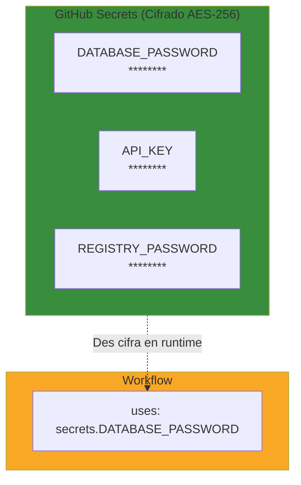

- [6. Implementación Práctica: Pipeline Fullstack](#6-implementación-práctica-pipeline-fullstack)
  - [6.1. Automatización del Backend](#61-automatización-del-backend)
    - [6.1.1. Estructura del pipeline backend](#611-estructura-del-pipeline-backend)
    - [6.1.2. 🛠️ Instalación de dependencias](#612-️-instalación-de-dependencias)
    - [6.1.3. 🛠️ Ejecución de tests de API](#613-️-ejecución-de-tests-de-api)
    - [6.1.4. 🛠️ Build y Dockerización](#614-️-build-y-dockerización)
  - [6.2. Automatización del Frontend](#62-automatización-del-frontend)
    - [6.2.1. Estructura del pipeline frontend](#621-estructura-del-pipeline-frontend)
    - [6.2.2. 🛠️ Building y minificación](#622-️-building-y-minificación)
    - [6.2.3. 🛠️ Tests de componentes](#623-️-tests-de-componentes)
    - [6.2.4. 🛠️ Lighthouse CI para performance](#624-️-lighthouse-ci-para-performance)
  - [6.3. Secretos de GitHub: Manejo seguro de claves de API y DB](#63-secretos-de-github-manejo-seguro-de-claves-de-api-y-db)
    - [6.3.1. ¿Qué son los Secrets?](#631-qué-son-los-secrets)
    - [6.3.2. 🛠️ Configuración de Secrets](#632-️-configuración-de-secrets)
    - [6.3.3. 🛠️ Usar Secrets en workflows](#633-️-usar-secrets-en-workflows)
    - [6.3.4. 🛠️ Scanning de secretos en el pipeline](#634-️-scanning-de-secretos-en-el-pipeline)
  - [6.4. Pipeline Unificado Fullstack](#64-pipeline-unificado-fullstack)
    - [Checklist de Supervivencia](#checklist-de-supervivencia)


# 6. Implementación Práctica: Pipeline Fullstack

Ha llegado el momento de poner todo en práctica. En este tema construiremos un **pipeline fullstack completo** que automatiza tanto el backend como el frontend, gestiona secretos de forma segura y garantiza la calidad en cada paso.

Imagina que tienes una aplicación con:
- **Backend**: API REST con .NET o Node.js
- **Frontend**: SPA con Vue.js, React o Angular
- **Base de datos**: PostgreSQL
- **Docker**: Contenedores para ambos


## 6.1. Automatización del Backend

### 6.1.1. Estructura del pipeline backend

```mermaid
flowchart TD
    subgraph BACKEND["Pipeline Backend"]
        START[("Push")] --> CHECKOUT[Checkout]
        CHECKOUT --> DEP[Install deps]
        DEP --> BUILD[Build]
        BUILD --> TEST_UNIT[Tests Unit]
        TEST_UNIT --> TEST_INT[Tests Integración]
        TEST_INT --> SECURITY[Security Scan]
        SECURITY --> DOCKER[Build Docker]
        DOCKER --> PUSH[Push Registry]
        PUSH --> END[("Listo")]
    end
    
    style CHECKOUT fill:#1976d2
    style DEP fill:#f9a825
    style BUILD fill:#388e3c
    style TEST_UNIT fill:#388e3c
    style TEST_INT fill:#f9a825
    style SECURITY fill:#c62828
    style DOCKER fill:#7b1fa2
```



### 6.1.2. 🛠️ Instalación de dependencias

```yaml
# Para .NET
- name: Setup .NET
  uses: actions/setup-dotnet@v4
  with:
    dotnet-version: '10.0.x'

- name: Restore dependencies
  run: dotnet restore

# Para Node.js
- name: Setup Node.js
  uses: actions/setup-node@v4
  with:
    node-version: '20'
    cache: 'npm'

- name: Install dependencies
  run: npm ci

# Para Java con Gradle
- name: Setup Java
  uses: actions/setup-java@v4
  with:
    java-version: '21'
    distribution: 'temurin'

- name: Cache Gradle
  uses: actions/cache@v4
  with:
    path: |
      ~/.gradle/caches
      ~/.gradle/wrapper
    key: ${{ runner.os }}-gradle-${{ hashFiles('**/*.gradle*') }}
    restore-keys: |
      ${{ runner.os }}-gradle-

- name: Build with Gradle
  run: ./gradlew build
```

### 6.1.3. 🛠️ Ejecución de tests de API

```yaml
# Tests unitarios
- name: Run unit tests
  run: dotnet test --filter "FullyQualifiedName~Unit" --verbosity minimal

# Tests de integración (con Testcontainers o database)
- name: Run integration tests
  run: dotnet test --filter "FullyQualifiedName~Integration" --verbosity minimal
  env:
    DATABASE_URL: ${{ secrets.DATABASE_URL }}

# Tests con generación de cobertura
- name: Run tests with coverage
  run: |
    dotnet test --collect:"XPlat Code Coverage" --results-directory ./TestResults
```

### 6.1.4. 🛠️ Build y Dockerización

```yaml
- name: Build Docker image
  run: docker build -t ${{ env.REGISTRY }}/backend:${{ github.sha }} .

- name: Login to Container Registry
  uses: docker/login-action@v3
  with:
    registry: ${{ env.REGISTRY }}
    username: ${{ secrets.REGISTRY_USER }}
    password: ${{ secrets.REGISTRY_PASSWORD }}

- name: Push Docker image
  run: |
    docker push ${{ env.REGISTRY }}/backend:${{ github.sha }}
    docker tag ${{ env.REGISTRY }}/backend:${{ github.sha }} ${{ env.REGISTRY }}/backend:latest
    docker push ${{ env.REGISTRY }}/backend:latest
```


## 6.2. Automatización del Frontend

### 6.2.1. Estructura del pipeline frontend


### 6.2.2. 🛠️ Building y minificación

```yaml
- name: Setup Node.js
  uses: actions/setup-node@v4
  with:
    node-version: '20'
    cache: 'npm'

- name: Install dependencies
  run: npm ci

- name: Lint
  run: npm run lint

- name: Build
  run: npm run build
  env:
    VITE_API_URL: ${{ secrets.API_URL }}

- name: Upload build artifacts
  uses: actions/upload-artifact@v4
  with:
    name: frontend-build
    path: dist/
    retention-days: 7
```

### 6.2.3. 🛠️ Tests de componentes

```yaml
# Con Vitest
- name: Run unit tests with Vitest
  run: npm run test:unit

# Con Jest
- name: Run Jest tests
  run: npm test -- --coverage

# Con Playwright (componentes)
- name: Install Playwright
  run: npx playwright install --with-deps

- name: Run component tests
  run: npm run test:component
```

### 6.2.4. 🛠️ Lighthouse CI para performance

```yaml
- name: Run Lighthouse CI
  uses: treosh/lighthouse-ci-action@v11
  with:
    urls: |
      https://staging.example.com
    configPath: ./lighthouserc.json
    uploadArtifacts: true
    temporaryStorage: 500

- name: Export results
  uses: actions/upload-artifact@v4
  with:
    name: lighthouse-results
    path: ./lighthouse-results/
```


## 6.3. Secretos de GitHub: Manejo seguro de claves de API y DB

### 6.3.1. ¿Qué son los Secrets?

Los **Secrets** son variables cifradas que almacenas en GitHub para usar en tus workflows. Nunca se muestran en logs ni en la UI:



### 6.3.2. 🛠️ Configuración de Secrets

**Desde la UI de GitHub:**
1. Ve a tu repositorio → **Settings**
2. Clic en **Secrets and variables** → **Actions**
3. Clic en **New repository secret**
4. Ingresa el nombre y valor
5. Clic en **Add secret**

**Tipos de secrets:**

| Tipo                     | Ejemplo                      | Cuándo usarlo                   |
| ------------------------ | ---------------------------- | ------------------------------- |
| **Repository secrets**   | Secrets específicos del repo | Credenciales de BD del proyecto |
| **Organization secrets** | Compartidos en la org        | Licencias compartidas           |
| **Environment secrets**  | Por entorno (prod/staging)   | Credenciales de producción      |

### 6.3.3. 🛠️ Usar Secrets en workflows

```yaml
jobs:
  deploy:
    runs-on: ubuntu-latest
    environment: production
    
    steps:
      - name: Connect to database
        run: |
          # Usando secreto como variable de entorno
          echo "Connecting to ${{ secrets.DATABASE_HOST }}"
      
      - name: Deploy
        run: ./deploy.sh
        env:
          # El secreto se inyecta como variable de entorno
          DATABASE_PASSWORD: ${{ secrets.DATABASE_PASSWORD }}
          API_KEY: ${{ secrets.API_KEY }}
          REGISTRY_PASSWORD: ${{ secrets.REGISTRY_PASSWORD }}
```

### 6.3.4. 🛠️ Scanning de secretos en el pipeline

```yaml
- name: Scan for secrets
  uses: trufflesecurity/truffleHog@v3
  with:
    repo_path: ./
    # Fail the pipeline if secrets are found
    fail: true
```

**Herramientas de scanning:**

| Herramienta        | Detecta               | Uso                   |
| ------------------ | --------------------- | --------------------- |
| **truffleHog**     | Secrets comprometidos | Scanning de historial |
| **gitleaks**       | Secrets en código     | En cada commit        |
| **detect-secrets** | Secrets hipotéticos   | Pre-commit            |


## 6.4. Pipeline Unificado Fullstack

```yaml
name: Fullstack CI/CD

on:
  push:
    branches: [ main, develop ]
  pull_request:
    branches: [ main ]

env:
  DOTNET_VERSION: '10.0.x'
  NODE_VERSION: '20'

jobs:
  # === BACKEND ===
  backend-build:
    name: Backend Build
    runs-on: ubuntu-latest
    
    steps:
      - uses: actions/checkout@v4
      
      - name: Setup .NET
        uses: actions/setup-dotnet@v4
        with:
          dotnet-version: ${{ env.DOTNET_VERSION }}
      
      - name: Restore dependencies
        run: dotnet restore
      
      - name: Build
        run: dotnet build --configuration Release
      
      - name: Run tests
        run: dotnet test --configuration Release --no-build --filter "FullyQualifiedName~Unit"
      
      - name: Upload test results
        uses: actions/upload-artifact@v4
        with:
          name: backend-test-results
          path: TestResults/
  
  backend-docker:
    name: Backend Docker
    needs: backend-build
    runs-on: ubuntu-latest
    
    steps:
      - uses: actions/checkout@v4
      
      - name: Build Docker image
        run: docker build -t ${{ env.REGISTRY }}/backend:${{ github.sha }} ./backend
      
      - name: Login to Registry
        uses: docker/login-action@v3
        with:
          registry: ${{ env.REGISTRY }}
          username: ${{ secrets.REGISTRY_USER }}
          password: ${{ secrets.REGISTRY_PASSWORD }}
      
      - name: Push image
        run: |
          docker push ${{ env.REGISTRY }}/backend:${{ github.sha }}
  
  # === FRONTEND ===
  frontend-build:
    name: Frontend Build
    runs-on: ubuntu-latest
    
    steps:
      - uses: actions/checkout@v4
      
      - name: Setup Node.js
        uses: actions/setup-node@v4
        with:
          node-version: ${{ env.NODE_VERSION }}
          cache: 'npm'
      
      - name: Install dependencies
        run: npm ci
      
      - name: Lint
        run: npm run lint
      
      - name: Run tests
        run: npm run test:unit -- --coverage
      
      - name: Build
        run: npm run build
        env:
          VITE_API_URL: ${{ secrets.API_URL }}
      
      - name: Upload build artifacts
        uses: actions/upload-artifact@v4
        with:
          name: frontend-build
          path: dist/
  
  # === DEPLOY ===
  deploy-staging:
    name: Deploy to Staging
    needs: [backend-docker, frontend-build]
    runs-on: ubuntu-latest
    environment: staging
    
    steps:
      - name: Download backend image
        run: docker pull ${{ env.REGISTRY }}/backend:${{ github.sha }}
      
      - name: Download frontend artifacts
        uses: actions/download-artifact@v4
        with:
          name: frontend-build
          path: dist/
      
      - name: Deploy to Staging
        run: ./deploy.sh staging
        env:
          BACKEND_IMAGE: ${{ env.REGISTRY }}/backend:${{ github.sha }}
          FRONTEND_DIST: ./dist
  
  deploy-production:
    name: Deploy to Production
    needs: deploy-staging
    runs-on: ubuntu-latest
    environment: production
    
    steps:
      - name: Deploy to Production
        run: ./deploy.sh production
        env:
          BACKEND_IMAGE: ${{ env.REGISTRY }}/backend:${{ github.sha }}
```

---

> **💡 Nota del Profesor**: Este pipeline fullstack demuestra todos los conceptos que hemos aprendido: jobs paralelos, dependencias entre jobs, artifacts, secrets, environments con protección, y Docker. Tómalo como plantilla y adáptalo a las necesidades de tu proyecto.

---

### Checklist de Supervivencia

- [ ] Puedo configurar un pipeline para backend (.NET/Node/Java)
- [ ] Sé cómo ejecutar tests con generación de cobertura
- [ ] Puedo Dockerizar la aplicación en el pipeline
- [ ] Sé configurar y usar Secrets de GitHub
- [ ] Conozco herramientas para scanning de secretos
- [ ] Puedo crear un pipeline unificado que orqueste backend + frontend
