- [7. Despliegue Automatizado](#7-despliegue-automatizado)
  - [7.1. Despliegue del Frontend: GitHub Pages, Netlify, Vercel](#71-despliegue-del-frontend-github-pages-netlify-vercel)
    - [7.1.1. GitHub Pages: Alojamiento estático nativo](#711-github-pages-alojamiento-estático-nativo)
    - [7.1.2. 🛠️ Deploy a GitHub Pages](#️-deploy-a-github-pages)
    - [7.1.3. Netlify: Deploy con características avanzadas](#712-netlify-deploy-con-características-avanzadas)
    - [7.1.4. 🛠️ Deploy a Netlify](#️-deploy-a-netlify)
    - [7.1.5. Vercel: Nativo para Next.js y React](#713-vercel-nativo-para-nextjs-y-react)
    - [7.1.6. 🛠️ Deploy a Vercel](#️-deploy-a-vercel)
  - [7.2. Despliegue del Backend: Dockerización, Render, AWS](#72-despliegue-del-backend-dockerización-render-aws)
    - [7.2.1. 🛠️ Dockerfile optimizado](#️-dockerfile-optimizado)
    - [7.2.2. 🛠️ Deploy a Render](#️-deploy-a-render)
    - [7.2.3. 🛠️ Deploy a AWS](#️-deploy-a-aws)
    - [7.2.4. 🛠️ Deploy con Kubernetes](#️-deploy-con-kubernetes)
  - [7.3. Rollback: Qué hacer cuando algo sale mal en producción](#73-rollback-qué-hacer-cuando-algo-sale-mal-en-producción)
    - [7.3.1. Estrategias de Rollback](#731-estrategias-de-rollback)
    - [7.3.2. 🛠️ Rollback automático en GitHub Actions](#️-rollback-automático-en-github-actions)
    - [7.3.3. 🛠️ Rollback con Docker](#️-rollback-con-docker)
    - [7.3.4. Monitorización para detección de problemas](#734-monitorización-para-detección-de-problemas)


# 7. Despliegue Automatizado

Ha llegado el momento de llevar tu aplicación de **desarrollo** a producción. En este tema aprenderás a desplegar automáticamente tanto el frontend como el backend, utilizando las plataformas más populares y las mejores prácticas de la industria.

El objetivo: **de tu commit a producción en minutos**, de forma automatizada y segura.


## 7.1. Despliegue del Frontend: GitHub Pages, Netlify, Vercel

### 7.1.1. GitHub Pages: Alojamiento estático nativo

**GitHub Pages** es la opción más simple para sitios estáticos. Viene integrado en GitHub:

| Característica | Descripción |
|----------------|-------------|
| **Coste** | Gratis (para repositorios públicos) |
| **Integración** | Nativa con GitHub |
| **SSL** | Automático con Let's Encrypt |
| **Dominio** | Personalizable (tuusuario.github.io/repo) |
| **Limitaciones** | Solo estático (HTML/CSS/JS) |

### 7.1.2. 🛠️ Deploy a GitHub Pages

```yaml
name: Deploy to GitHub Pages

on:
  push:
    branches: [ main ]
  workflow_dispatch:

permissions:
  contents: read
  pages: write
  id-token: write

jobs:
  deploy:
    environment:
      name: github-pages
      url: ${{ steps.deployment.outputs.page_url }}
    runs-on: ubuntu-latest
    steps:
      - name: Checkout
        uses: actions/checkout@v4
      
      - name: Setup Pages
        uses: actions/configure-pages@v4
      
      - name: Upload artifact
        uses: actions/upload-pages-artifact@v3
        with:
          path: dist/
      
      - name: Deploy to GitHub Pages
        id: deployment
        uses: actions/deploy-pages@v4
```

### 7.1.3. Netlify: Deploy con características avanzadas

**Netlify** es ideal para aplicaciones web modernas con características avanzadas:

| Característica | Descripción |
|----------------|-------------|
| **Build optimizado** | Detección automática de framework |
| **Edge Network** | CDN global automático |
| **Preview Deploys** | URL única por PR |
| **Forms** | Formularios sin backend |
| **Functions** | Serverless functions |
| **Rollbacks** | Un clic para revertir |
| **Split Testing** | A/B testing nativo |

### 7.1.4. 🛠️ Deploy a Netlify

```yaml
name: Deploy to Netlify

on:
  push:
    branches: [ main ]
  pull_request:
    types: [opened, synchronize]

jobs:
  deploy:
    runs-on: ubuntu-latest
    
    steps:
      - uses: actions/checkout@v4
      
      - name: Setup Node.js
        uses: actions/setup-node@v4
        with:
          node-version: '20'
      
      - name: Install dependencies
        run: npm ci
      
      - name: Build
        run: npm run build
      
      - name: Deploy to Netlify
        uses: nwtgck/actions-netlify@v3
        with:
          publish-dir: './dist'
          production-branch: main
          github-token: ${{ secrets.GITHUB_TOKEN }}
          deploy-message: "Deploy from GitHub Actions"
        env:
          NETLIFY_AUTH_TOKEN: ${{ secrets.NETLIFY_AUTH_TOKEN }}
          NETLIFY_SITE_ID: ${{ secrets.NETLIFY_SITE_ID }}
```

**Configuración de Deploy Previews:**

```
En Netlify Dashboard:
Site settings → Build & deploy → Continuous deployment

✅ Build hooks
✅ Deploy previews
✅ Branch deploys
✅ Split testing (A/B)
```

### 7.1.5. Vercel: Nativo para Next.js y React

**Vercel** es el creadores de Next.js y tiene integración perfecta:

| Característica | Descripción |
|----------------|-------------|
| **Next.js native** | Optimizaciones automáticas |
| **Edge Functions** | Serverless en el edge |
| **Analytics** | Monitorización integrada |
| **Preview** | URLs automáticas por PR |
| **Instant Rollback** | Revertir en segundos |

### 7.1.6. 🛠️ Deploy a Vercel

```yaml
name: Deploy to Vercel

on:
  push:
    branches: [ main ]
  pull_request:
    types: [opened, synchronize]

jobs:
  deploy:
    runs-on: ubuntu-latest
    
    steps:
      - uses: actions/checkout@v4
      
      - name: Install Vercel CLI
        run: npm i -g vercel
      
      - name: Pull Vercel Environment
        run: vercel pull --yes --environment=production --token=${{ secrets.VERCEL_TOKEN }}
      
      - name: Build Vercel
        run: vercel build --token=${{ secrets.VERCEL_TOKEN }}
      
      - name: Deploy Vercel
        if: github.ref == 'refs/heads/main'
        run: vercel deploy --prebuilt --token=${{ secrets.VERCEL_TOKEN }}
```


## 7.2. Despliegue del Backend: Dockerización, Render, AWS

### 7.2.1. 🛠️ Dockerfile optimizado

**Multi-stage build para .NET:**

```dockerfile
# Etapa 1: Build
FROM mcr.microsoft.com/dotnet/sdk:10.0 AS build
WORKDIR /src
COPY *.csproj ./
RUN dotnet restore
COPY . .
RUN dotnet publish -c Release -o /publish

# Etapa 2: Runtime
FROM mcr.microsoft.com/dotnet/aspnet:10.0 AS runtime
WORKDIR /publish
COPY --from=build /publish .
ENV ASPNETCORE_URLS=http://+:5000
EXPOSE 5000
ENTRYPOINT ["dotnet", "MiApp.dll"]
```

**Multi-stage build para Node.js:**

```dockerfile
# Etapa 1: Dependencias
FROM node:20-alpine AS deps
WORKDIR /app
COPY package*.json ./
RUN npm ci --only=production

# Etapa 2: Build
FROM node:20-alpine AS builder
WORKDIR /app
COPY . .
COPY --from=deps /app/node_modules ./node_modules
RUN npm run build

# Etapa 3: Runtime
FROM node:20-alpine AS runner
WORKDIR /app
ENV NODE_ENV=production
COPY --from=builder /app/dist ./dist
COPY --from=deps /app/node_modules ./node_modules
EXPOSE 3000
CMD ["node", "dist/index.js"]
```

### 7.2.2. 🛠️ Deploy a Render

**Render** ofrece servicios gestionados para backend:

```yaml
# Deploy hook para Render
# Settings → Deploy → Deploy Hook
name: Deploy to Render

on:
  push:
    branches: [ main ]

jobs:
  deploy:
    runs-on: ubuntu-latest
    
    steps:
      - name: Trigger Render Deploy
        run: |
          curl -X POST \
            -H "Authorization: Bearer ${{ secrets.RENDER_DEPLOY_HOOK }} \
            "https://api.render.com/deploy/srv-xxxxx
```

### 7.2.3. 🛠️ Deploy a AWS

**Con ECR y ECS:**

```yaml
name: Deploy to AWS ECS

on:
  push:
    branches: [ main ]

jobs:
  deploy:
    runs-on: ubuntu-latest
    
    steps:
      - uses: actions/checkout@v4
      
      - name: Configure AWS credentials
        uses: aws-actions/configure-aws-credentials@v4
        with:
          aws-access-key-id: ${{ secrets.AWS_ACCESS_KEY_ID }}
          aws-secret-access-key: ${{ secrets.AWS_SECRET_ACCESS_KEY }}
          aws-region: eu-west-1
      
      - name: Login to Amazon ECR
        id: login-ecr
        uses: aws-actions/amazon-ecr-login@v2
      
      - name: Build, tag, and push image to Amazon ECR
        env:
          ECR_REGISTRY: ${{ steps.login-ecr.outputs.registry }}
          REPOSITORY: miapp
          IMAGE_TAG: ${{ github.sha }}
        run: |
          docker build -t $ECR_REGISTRY/$REPOSITORY:$IMAGE_TAG .
          docker push $ECR_REGISTRY/$REPOSITORY:$IMAGE_TAG
      
      - name: Deploy to Amazon ECS
        uses: aws-actions/amazon-ecs-deploy-task-definition@v1
        with:
          task-definition: task-definition.json
          service: miapp-service
          cluster: miapp-cluster
          wait-for-service-stability: true
```

### 7.2.4. 🛠️ Deploy con Kubernetes

```yaml
name: Deploy to Kubernetes

on:
  push:
    branches: [ main ]

jobs:
  deploy:
    runs-on: ubuntu-latest
    
    steps:
      - uses: actions/checkout@v4
      
      - name: Configure AWS credentials
        uses: aws-actions/configure-aws-credentials@v4
        with:
          aws-access-key-id: ${{ secrets.AWS_ACCESS_KEY_ID }}
          aws-secret-access-key: ${{ secrets.AWS_SECRET_ACCESS_KEY }}
          aws-region: eu-west-1
      
      - name: Update Kubernetes
        uses: actions-hub/kubectl@master
        with:
          args: set image deployment/miapp backend=${{ secrets.ECR_REGISTRY }}/backend:${{ github.sha }} -n production
        env:
          KUBECONFIG_FILE: ${{ secrets.KUBECONFIG }}
```


## 7.3. Rollback: Qué hacer cuando algo sale mal en producción

### 7.3.1. Estrategias de Rollback

```mermaid
flowchart TB
    subgraph ROLLBACK["Estrategias de Rollback"]
        
        subgraph MANUAL["Manual"]
            M1["Revertir commit<br/>git revert"]
            M2["Revertir merge<br/>git revert -m 1"]
        end
        
        subgraph AUTOMATIC["Automático"]
            A1["Rollback automático<br/>si health check falla"]
            A2["Blue-Green<br/>Switch al ambiente anterior"]
            A3["Canary<br/>Reducir tráfico a nuevo"]
        end
        
        subgraph INFRA["Basado en Infraestructura"]
            I1["Docker: Previous image"]
            I2["K8s: Previous replica"]
            I3["Cloud: Previous version"]
        end
        
    end
    
    style MANUAL fill:#c62828
    style AUTOMATIC fill:#388e3c
    style INFRA fill:#f9a825
```



### 7.3.2. 🛠️ Rollback automático en GitHub Actions

```yaml
name: Deploy with Rollback

on:
  push:
    branches: [ main ]

jobs:
  deploy:
    runs-on: ubuntu-latest
    environment: production
    
    steps:
      - name: Deploy
        id: deploy
        run: ./deploy.sh production
        env:
          VERSION: ${{ github.sha }}
      
      - name: Health Check
        run: |
          sleep 30
          response=$(curl -s -o /dev/null -w "%{http_code}" https://api.example.com/health)
          if [ "$response" != "200" ]; then
            echo "Health check failed!"
            exit 1
          fi
      
      - name: Notify Success
        if: success()
        run: echo "✅ Deployment successful"
      
      - name: Rollback on Failure
        if: failure()
        run: |
          echo "🚨 Deployment failed! Triggering rollback..."
          ./rollback.sh production ${{ github.sha }}
```

### 7.3.3. 🛠️ Rollback con Docker

```bash
#!/bin/bash
# rollback.sh

VERSION=$1
PREVIOUS_IMAGE=$(aws ecr describe-images --repository-name miapp --query 'imageDetails[0].imageTags[-2]' --output text)

echo "Rolling back to: $PREVIOUS_IMAGE"

aws ecr batch-delete-image \
  --repository-name miapp \
  --image-ids imageTag=bad-$VERSION

aws ecs update-service \
  --cluster miapp-cluster \
  --service miapp-service \
  --force-new-deployment
```

### 7.3.4. Monitorización para detección de problemas

```yaml
- name: Monitor after deploy
  run: |
    echo "Waiting for deployment to stabilize..."
    sleep 60
    
    # Check error rate
    ERROR_RATE=$(curl -s https://api.example.com/metrics | jq '.error_rate')
    echo "Error rate: $ERROR_RATE"
    
    # Check latency
    LATENCY=$(curl -s https://api.example.com/metrics | jq '.p95_latency')
    echo "P95 latency: $LATENCY"
    
    # Rollback if metrics are bad
    if (( $(echo "$ERROR_RATE > 0.05" | bc -l) )); then
      echo "Error rate too high! Rolling back..."
      ./rollback.sh production
      exit 1
    fi
```

**Métricas críticas para rollback:**

| Métrica | Umbral | Acción |
|---------|--------|--------|
| **Error Rate** | > 5% | Investigar |
| **Latency P95** | > 500ms | Investigar |
| **HTTP 500s** | Cualquier incremento | Rollback inmediato |
| **Health check** | < 200 | Rollback inmediato |

---

> **💡 Nota del Profesor**: El rollback no es un fracaso; es una característica de seguridad. Un buen sistema de rollback te permite experimentar con confianza, sabiendo que si algo sale mal, puedes volver atrás en segundos. La monitorización es tu sistema de alerta temprana.

---

### Checklist de Supervivencia

- [ ] Puedo desplegar un frontend estático a GitHub Pages, Netlify y Vercel
- [ ] Sé crear un Dockerfile optimizado con multi-stage builds
- [ ] Conozco cómo desplegar backend a Render y AWS
- [ ] Puedo configurar deploy hooks para despliegues automáticos
- [ ] Entiendo diferentes estrategias de rollback
- [ ] Sé configurar monitorización post-deployment
