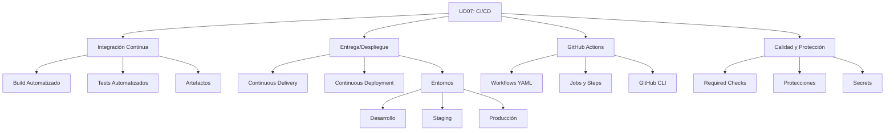

- [8. Resumen](#8-resumen)
  - [8.1. Mapa Conceptual de la Unidad](#81-mapa-conceptual-de-la-unidad)
  - [8.2. Conceptos Clave](#82-conceptos-clave)
  - [8.3. Comparativa de Conceptos](#83-comparativa-de-conceptos)
  - [8.4. Checklist de Supervivencia](#84-checklist-de-supervivencia)

# 8. Resumen

## 8.1. Mapa Conceptual de la Unidad

## 8.2. Conceptos Clave

### DevOps y CI/CD

| Concepto | Descripción |
|----------|-------------|
| **DevOps** | Cultura de colaboración entre Desarrollo y Operaciones |
| **CI** | Integración Continua: integrar código frecuentemente con validación automática |
| **CD (Delivery)** | Software siempre listo para producción, requiere aprobación manual |
| **CD (Deployment)** | Despliegue Continuo: despliegue automático a producción |
| **Flujo de Valor** | Camino del código al usuario que debemos optimizar |
| **Shift Left** | Realizar testing lo más temprano posible en el ciclo |

### GitHub Actions

| Concepto | Descripción |
|----------|-------------|
| **Workflow** | Proceso automatizado definido en YAML |
| **Job** | Unidad de ejecución que contiene steps |
| **Step** | Tarea individual (run o uses) |
| **Runner** | Servidor donde se ejecutan los jobs |
| **Artifact** | Archivo generado para compartir entre jobs |
| **Secret** | Variable cifrada para credenciales |
| **Environment** | Contexto de despliegue con protecciones |

### Estrategias de Despliegue

| Estrategia | Downtime | Complejidad | Cuándo usarla |
|------------|-----------|-------------|---------------|
| **Recreate** | Sí | Baja | Prototipos, bajo riesgo |
| **Rolling** | No | Media | Aplicaciones stateless |
| **Blue-Green** | No | Alta | Máxima disponibilidad |
| **Canary** | No | Muy alta | Validación gradual |

### Estrategias de Branching

| Estrategia | Ramas principales | Cuándo usarla |
|------------|-------------------|---------------|
| **Git Flow** | main + develop | Proyectos con releases planificados |
| **GitHub Flow** | main + features | Deployment continuo |
| **Trunk-Based** | trunk + short-lived | Alta velocidad, CI/CD maduro |

## 8.3. Comparativa de Conceptos

### CI vs CD (Delivery) vs CD (Deployment)

| Aspecto | CI | CD (Delivery) | CD (Deployment) |
|---------|-----|---------------|-----------------|
| **Build automático** | ✅ | ✅ | ✅ |
| **Tests automatizados** | ✅ | ✅ | ✅ |
| **Deploy a staging** | ✅ | ✅ | ✅ |
| **Deploy a producción** | ❌ | ✅ Con aprobación | ✅ Automático |
| **Control humano** | N/A | ✅ En producción | ❌ |

### Plataformas de Despliegue

| Plataforma | Tipo | Ideal para | Coste |
|------------|------|-----------|-------|
| **GitHub Pages** | Estático | Documentación, SPA simples | Gratis |
| **Netlify** | Estático + Serverless | React, Vue, Angular | Freemium |
| **Vercel** | Estático + Edge | Next.js, React | Freemium |
| **Render** | Backend gestionado | APIs, Workers | Freemium |
| **AWS** | Cloud completo | Aplicaciones enterprise | Pago por uso |

## 8.4. Checklist de Supervivencia

Antes de dar por cerrada la unidad, asegúrate de poder responder **SÍ** a estas preguntas:

### Fundamentos
- [ ] ¿Entiendo qué es DevOps y en qué se diferencia de los silos tradicionales?
- [ ] ¿Puedo explicar el flujo de valor y las métricas DORA?
- [ ] ¿Sé qué significa "Shift Left" y por qué es importante?

### Integración Continua
- [ ] ¿Puedo crear un pipeline de CI con GitHub Actions?
- [ ] ¿Sé ejecutar tests unitarios y de integración en el pipeline?
- [ ] ¿Conozco cómo configurar linting y análisis estático?
- [ ] ¿Puedo gestionar artefactos entre jobs?

### Entrega y Despliegue
- [ ] ¿Entiendo la diferencia entre Continuous Delivery y Deployment?
- [ ] ¿Sé configurar entornos con protecciones y aprobaciones manuales?
- [ ] ¿Conozco las estrategias de despliegue y sus pros/contras?

### Herramientas
- [ ] ¿Domino la sintaxis YAML de GitHub Actions?
- [ ] ¿Puedo configurar jobs paralelos y con dependencias?
- [ ] ¿Sé usar GitHub CLI para gestionar workflows?
- [ ] ¿Conozco cómo usar Secrets de forma segura?

### Calidad y Protección
- [ ] ¿Puedo configurar Branch Protection Rules en GitHub?
- [ ] ¿Sé qué son y cómo configurar Required Status Checks?
- [ ] ¿Entiendo cómo bloquear el merge si los tests fallan?
- [ ] ¿Puedo configurar CODEOWNERS para revisión automática?

### Despliegue
- [ ] ¿Puedo desplegar un frontend a Netlify/Vercel?
- [ ] ¿Sé crear Dockerfiles optimizados con multi-stage builds?
- [ ] ¿Conozco estrategias de rollback?
- [ ] ¿Puedo configurar monitorización post-deployment?

---

📝 **Nota del Profesor:** Este checklist te ayuda a verificar que dominas todos los conceptos de la UD07.

💡 **Tip del Examinador:** Las preguntas sobre diferencias entre CI/CD, estrategias de despliegue y configuración de Branch Protection son las más frecuentes en los exámenes.
